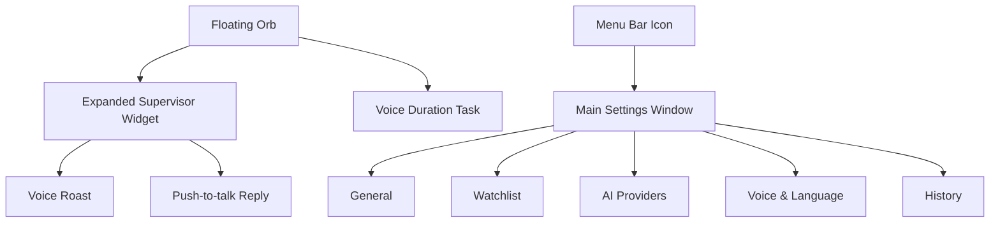

# Hunter Design Draft

版本：v0.9
日期：2026-05-30
状态：页面契约锁定，真实 DOM HTML 设计稿已生成

## Design Positioning

Hunter 的设计方向从“监控后台”改为 **Apple-like 的桌面监督小组件**。用户日常只看到一个低干扰悬浮球；用户可以直接按住快捷键说“监督我接下来的 40 分钟”创建时长任务；发现摸鱼时，悬浮球展开成小组件并直接语音吐槽。主窗口只在用户主动打开时出现，用来做设置、API Key、黑名单和历史记录。

这不是黑暗风格的 AI 控制台，也不是功能堆满的效率 Dashboard。它应该更像 macOS 原生工具：轻、静、精致、克制，有足够高级感，但抓包瞬间有戏剧性。

## Visual Direction

- 风格：macOS 原生、浅色、高留白、低饱和。Material 只用于 toast 或系统式窗口背景；抓包卡片和圆形悬浮球都不能出现半透明灰色外壳。
- 主色：Apple Blue `#007AFF`，抓包强调色 `#FF3B30`，成功色 `#34C759`。
- 背景：浅灰系统背景 `#F5F5F7`，窗口使用半透明白色。
- 字体：SF Pro / system font。
- 圆角：悬浮球 50%，小组件 18-22px，主窗口 16px。
- 阴影：柔和、真实，不做厚重暗色投影。
- 动效：悬浮球展开 180-240ms，状态变化轻微缩放，不做复杂炫技动画。

## 2026-05-30 Redesign References

本轮按 `vibe-product-builder -> PRD 页面契约 -> imagegen-to-html-design -> screenshot-to-code -> SwiftUI 实现` 重新走设计开发流程。`index.html` 是可批阅的真实 DOM/CSS 设计稿；PNG 只作为视觉参考，不作为整页背景。新参考图和 HTML 已保存到：

- `docs/design-prototype/redesign-2026-05-30/index.html`
- `docs/design-prototype/redesign-2026-05-30/design-system-board.png`
- `docs/design-prototype/redesign-2026-05-30/asset-sheet.png`
- `docs/design-prototype/redesign-2026-05-30/settings-general-watchlist-ai.png`
- `docs/design-prototype/redesign-2026-05-30/settings-voice-history-states.png`
- `docs/design-prototype/redesign-2026-05-30/floating-widget-states.png`
- `docs/design-prototype/redesign-2026-05-30/settings-window-reference.png`
- `docs/design-prototype/redesign-2026-05-30/floating-widget-reference.png`
- `docs/design-prototype/redesign-2026-05-30/component-board-reference.png`

采用内容：

- HTML Design Artifact：设置页五个 tab、悬浮组件状态、组件状态板、PRD 覆盖矩阵必须使用真实 DOM/CSS 重建，不允许只嵌入截图。
- Settings Window：左侧 196px sidebar、右侧自适应单列 section 列表、白色实体 settings card、低饱和蓝色选中态。
- Floating Widget：圆形头像 + 完整倒计时环，无方形底板、无绿点；快捷控制和抓包卡片都使用实体 white popover。
- Component Board：颜色、字号、间距、权限状态 pill、快捷键录制框、Provider 卡片、App picker row、声波状态。
- Asset Sheet：默认头像方向为极简墨镜眼睛；上传头像为圆形裁切；App 图标优先用系统/真实 App 图标，设计稿里的 glyph 只是占位。

不采用内容：

- 参考图里由模型误生成的动物头像、emoji 装饰和多余 “Change” 按钮不是产品需求；默认头像仍使用 Hunter 墨镜眼睛图标，所有可见控件以 `docs/PRD.md` 的 2A 页面契约为准。

## Information Architecture



## Primary Experience: Floating Supervisor

### Idle / Monitoring Orb

默认只有一个桌面悬浮球，用户可以拖动到屏幕边缘。悬浮球不展示复杂数据，避免像监控器一样压迫。

```text
┌──────┐
│  H   │  48-64px
└──────┘
```

状态：

- Focus：圆形头像 + 边缘倒计时环；时长任务剩余越少，圆环越短。
- Paused：圆形头像 + 暂停态边缘，不使用右下角状态点。
- Caught：球体轻微放大并变为红色强调。
- Listening：圆形头像外侧显示绿色呼吸圆环，让用户明确感知正在收音。
- Speaking：显示播放波形。
- Session Started：轻量 toast 确认“40-minute focus session started”。
- 图标固定为圆形裁切，默认使用 Hunter 墨镜图标；用户可以在设置页上传头像并恢复默认。头像内容必须比倒计时环更小并收在圆环内侧，不要给图标增加方形、半透明或灰色底板；空闲态悬浮窗尺寸应贴合圆形图标但保留 4px 安全边距，边缘倒计时环必须完整显示，不能被裁切。

### Quick Control Menu

用户点击悬浮球时，不打开主窗口，而是在原位置展开一个轻量快捷菜单，让桌面小组件承担大部分日常控制。

```text
┌──────────────────────────────┐
│ 快捷监督              14:58   │
│ 时长任务进行中                 │
│ 蓝色剩余进度条                 │
│ [15 分钟] [25 分钟] [40 分钟]  │
│ [暂停] [取消]                 │
│ 按住 Option + Space 对话       │
└──────────────────────────────┘
```

原则：

- 菜单只承载高频动作：开始 15/25/40 分钟监督、暂停/恢复、取消监督、展示当前倒计时。
- 倒计时进度条必须用 Apple Blue 展示剩余时间，背景轨道只作为低对比度参照，不能让用户误解哪一段才是剩余。
- “取消”表示立即结束当前时长任务并停止监督；不再提供语义模糊的“停止”按钮。
- 不展示 Provider、日志、模型状态等设置项。
- 菜单使用实体白色 popover 质感，不出现灰色半透明底板。
- 点击快捷分钟后立即创建时长任务；用户也可以按住快捷键说出监督时长完成同一件事。
- 快捷菜单和设置页读取同一个时长任务状态，倒计时、暂停和取消必须同步。
- 快捷菜单如果用户 6 秒内没有操作，需要自动收起；用户手动再次点击收起时，悬浮球必须保持原位置，不允许因为窗口尺寸变化而跳动。

### Voice Duration Task

用户按住回击快捷键时，除了对喷，也可以直接创建一个监督时长任务：

```text
用户说：监督我接下来的 40 分钟
Hunter：40 分钟监督已开始
```

交互原则：

- 不打开主窗口。
- 悬浮球外侧显示绿色呼吸圆环，确认正在收音。
- 解析成功后出现 2-4 秒确认 toast，toast 使用实体白色 popover 背景，不出现灰色半透明矩形外壳，并自动消失。
- 悬浮球进入倒计时监督态。
- 支持中文和英文：“监督我接下来的 40 分钟” / “Keep me focused for 40 minutes”。
- ASR 命令识别默认使用自动/中英混合，不跟随 AI 监督语言；时长解析支持“三十五分钟”“半小时”“一个半小时”等常见口语。

### Focus Session Completion

时长任务到点结束时，悬浮球给出短 toast 并播放一句总结语音：

- 0 次抓包：彩虹屁夸奖。
- 1-3 次抓包：轻度鼓励，承认中间摸鱼但强调完成了。
- 4 次及以上：吐槽式总结；如果用户允许粗口，可以更狠一点，但仍不攻击受保护属性。

这条语音使用当前云端 TTS Provider，不回退到系统朗读。

### Expanded Catch Widget

命中黑名单时，Hunter 先在后台完成第一句 LLM + TTS 准备；音频可播放后，悬浮球展开成一个 320-360px 的桌面小组件并同步播报，避免用户先看到等待状态。

```text
┌────────────────────────────────────┐
│ Caught on YouTube              10:21│
│                                    │
│ “Back to YouTube? Bold choice for  │
│ someone losing to a deadline.”     │
│                                    │
│  语音波形                           │
│ [按住 Option Space 对话] [Pause]     │
└────────────────────────────────────┘
```

原则：

- 小组件不做大红大黑警报风，只用红色作为精准强调。
- 小组件不展示 LLM、ASR、TTS、Provider、模型组合、合成中或播放中等内部状态。
- 小组件背景使用实体白色/系统 popover 色，不使用灰色半透明外圈；阴影必须极轻，不能形成一圈灰色雾面背景。
- 文案区域最多 3 行，避免遮挡桌面。
- 支持中英文文案，英文长句需要自动换行。
- 用户按快捷键或卡片按钮反驳时，小组件切换为 listening 状态；卡片按钮只展示“按住 {用户设置的快捷键} 对话 / Hold {shortcut} to talk”，按下开始录音、松开发送，不出现“连续对喷”等内部机制文案。
- Hunter 播报回击后，卡片保持同一对话上下文并等待用户再次按住快捷键；不要在后台自动开始下一轮录音，避免用户第二次按键时出现抢麦克风或状态冲突。
- 声波条在 Hunter 播放 TTS 和用户按住录音时持续起伏；转写、思考、空闲时保持静态，避免假装一直在听。
- 抓包卡片在播报完成后等待用户几秒；如果用户没有按住回击或点击暂停，自动收起。
- 背景使用干净的实体 macOS popover 质感，不再使用大面积浅色透明 material 色块。

## Main Window

主窗口是用户主动打开才看到的地方。不要放复杂实时监控大屏，只做轻设置。

### Layout

```text
┌──────────────────────────────────────────────────────────────┐
│                         Hunter                               │
├──────────────┬───────────────────────────────────────────────┤
│ General      │ Floating Supervisor                           │
│              │ Focus session 40 min remaining                 │
│ Watchlist    │ [On]  Work hours 09:30-12:00                  │
│ AI Providers │ Widget style: Minimal / Compact               │
│ Voice        │ Shortcut: Option Space                        │
│ History      │                                               │
│              │                                               │
│ UI / AI Lang │                                               │
│ Start        │                                               │
└──────────────┴───────────────────────────────────────────────┘
```

主窗口设置页遵循统一的 macOS 设置布局：

- 左侧 sidebar 固定 196px 宽，导航项整行可点，选中态使用低饱和蓝色背景。
- Sidebar 字体规范：品牌名 13px/17px semibold，副标题 11px/14px regular；导航中文主标签 13px/18px medium，英文副标签 12px/16px regular；单个导航项高度 40px，上下间距 4px，选中态圆角 9px。
- 右侧内容使用单列 section 列表并充分利用可用宽度；不要因为 760px 固定窄列造成大面积空白。
- 内容区不重复展示当前 sidebar 已选中的页面大标题，例如选中 General 后右侧不要再出现一个“通用”大标题。
- 每个设置项使用上下结构：section 标题和说明在卡片外上方；具体开关、输入框、列表、按钮放在下面的白色卡片里。
- 卡片内部可以横向排列少量控件，但不得把“标题说明”和“控件区”做成左右分栏。
- 输入表单使用上标签字段，而不是窄侧标签，避免 Provider、Model、Base URL、API Key 在同一行里挤压。
- 测试按钮和预设按钮使用自适应网格/横向滚动，不硬挤成一排。
- Toggle 带文字时必须保证不换行；窄控件区使用文字 + 独立 switch。
- 时长任务必须提供常用预设和自定义分钟输入。
- 工作时段必须允许用户直接编辑开始时间、结束时间、启用状态，并添加/删除时间段。
- 快捷键设置只展示一个可录制输入框；点击后同一个框进入录制态，不要并排显示“Option + Space”和“Press keys”两个框。

### General

- 开始/暂停监督。
- Focus Session：当前临时时长监督任务、剩余时间、修改/结束。
- 工作时间段。
- 悬浮球显示位置和尺寸。
- 悬浮球头像：固定圆形裁切，上传自定义头像，恢复默认头像。
- 快捷键设置：默认 `Option + Space`，用户点击快捷键输入框后直接按新的组合键或单键完成录制；输入框内以 `Key + Key` 或单键形式展示，抓包卡片和全局监听必须读取同一份配置。单独的修饰键也必须可录制和可用，例如 `Right Option`。
- 开机启动。

### Watchlist

- 网站黑名单。
- App 黑名单。
- 本机 App 选择器：读取 `/Applications`、`~/Applications` 和 `/System/Applications` 下的 `.app`，显示 App 图标、名称和 Bundle ID，支持搜索和一键添加为 App 黑名单。
- 常用预设包。
- 每条规则只显示名称、匹配、冷却和启用状态。

### AI Providers

保持三段完全独立配置，不做全局“基础配置”联动：

```text
ASR  [本地模型 / 云端 API]  SenseVoice Small / Provider Base URL Model API Key
LLM  Provider  Base URL  Model  API Key
TTS  Provider  Base URL  Model  API Key
Search  [开关]  Brave Search / Tavily  Base URL  Model  API Key
```

用户可以让 ASR、LLM、TTS 和搜索增强分别使用不同厂商。API Key 通过设置页写入本机 Application Support `.env.local`，不提交仓库、不展示明文、不进入日志。鉴权 scheme、headers、region、语言提示和流式能力不在 MVP UI 中展示，由 adapter 默认处理。

ASR 的本地模型模式只展示模型名称、能力说明、来源和“下载到本机”按钮。模型保存在 Hunter 的 Application Support 目录，不混进项目仓库，也不上传用户音频。本地 ASR 下载后可直接用于语音时长任务。TTS 不再提供本地模型模式，只使用云端 Provider。

搜索增强默认关闭。打开后只显示一个轻量 Search 卡片，推荐 Brave Search，允许改 Tavily。说明文案必须明确：只用当前页面标题/域名做 query，返回少量摘要给 LLM，不上传完整浏览历史。

### Voice & Language

- 界面语言：中文 / English。
- AI 监督语言：跟随界面 / 中文 / English。
- 监督语言影响 LLM 输出和 TTS 语言提示；若模型返回明显错误语言，需要使用目标语言兜底短句，不能让 English 模式继续播中文抓包。
- 角色：毒舌同事、老板附体、自律教练。
- 强度：温柔、阴阳怪气、破防模式。
- 音色：云端 TTS voice id，默认 `longanyang`。
- 克隆声音：MVP 不再提供本地声音克隆入口；声音页需要露出“音色克隆”区域，但上传/录制样本保持禁用态并明确标注为云端克隆待接入；后续如接云端克隆/音色设计，只保存 Provider 返回的授权音色 ID。

### History

历史记录只展示对用户有用的轻量信息：

- 时间。
- 命中对象。
- 摸鱼时长。
- AI 名场面。

不做复杂图表，不做“数据驾驶舱”。

## HTML Prototype

当前 HTML 原型位于：

- `docs/design-prototype/redesign-2026-05-30/index.html`
- 生成图参考目录：`docs/design-prototype/redesign-2026-05-30/`

重要边界：

- HTML 不能把生成图作为整页背景；生成图只放在“生成图视觉参考”区域。
- HTML 不展示 macOS 桌面壁纸、系统菜单栏、Dock。
- 实际产品界面只包含 Hunter 悬浮球、抓包小组件、时长任务 toast、设置主窗口和菜单栏状态入口。

原型需要体现：

- Apple-like 浅色、高级、简约风格。
- 桌面悬浮球和展开小组件是第一视觉。
- 支持语音创建时长监督任务的 toast/确认态。
- 主窗口只做轻量设置。
- Provider 可配置，但默认折叠为三行。
- 中英文界面和 AI 语言可切换。
- 主窗口导航使用左侧竖向 sidebar；顶部不做横向菜单。

## Design Acceptance Checklist

- 第一眼看到的是悬浮监督器，不是后台 Dashboard。
- 主窗口不超过 5 个侧边栏入口。
- Provider 配置默认收起，不压迫普通用户。
- 语音时长任务入口可以不打开主窗口完成。
- 中英文文案在小组件里都不溢出。
- 抓包状态有戏剧性，但不破坏整体高级感。
- 界面整体接近 macOS 原生软件，而不是暗黑 AI 工具。
