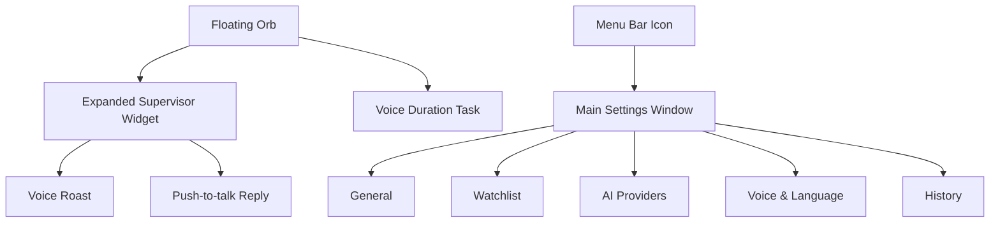

# Hunter Design Draft

版本：v0.3  
日期：2026-05-27  
状态：待审阅

## Design Positioning

Hunter 的设计方向从“监控后台”改为 **Apple-like 的桌面监督小组件**。用户日常只看到一个低干扰悬浮球；用户可以直接按住快捷键说“监督我接下来的 40 分钟”创建时长任务；发现摸鱼时，悬浮球展开成小组件并直接语音吐槽。主窗口只在用户主动打开时出现，用来做设置、API Key、黑名单和历史记录。

这不是黑暗风格的 AI 控制台，也不是功能堆满的效率 Dashboard。它应该更像 macOS 原生工具：轻、静、精致、克制，有足够高级感，但抓包瞬间有戏剧性。

## Visual Direction

- 风格：macOS 原生、半透明 material、浅色、高留白、低饱和。
- 主色：Apple Blue `#007AFF`，抓包强调色 `#FF3B30`，成功色 `#34C759`。
- 背景：浅灰系统背景 `#F5F5F7`，窗口使用半透明白色。
- 字体：SF Pro / system font。
- 圆角：悬浮球 50%，小组件 18-22px，主窗口 16px。
- 阴影：柔和、真实，不做厚重暗色投影。
- 动效：悬浮球展开 180-240ms，状态变化轻微缩放，不做复杂炫技动画。

## Information Architecture



## Primary Experience: Floating Supervisor

### Idle / Monitoring Orb

默认只有一个桌面悬浮球，用户可以拖动到屏幕边缘。悬浮球不展示复杂数据，避免像监控器一样压迫。

```text
┌──────┐
│  H   │  48-64px
└──────┘
```

状态：

- Focus：白色半透明球 + 绿色微光点。
- Paused：白色半透明球 + 黄色微光点。
- Caught：球体轻微放大并变为红色强调。
- Listening：显示细线波形。
- Speaking：显示播放波形。
- Session Started：轻量 toast 确认“40-minute focus session started”。

### Voice Duration Task

用户按住回击快捷键时，除了对喷，也可以直接创建一个监督时长任务：

```text
用户说：监督我接下来的 40 分钟
Hunter：40 分钟监督已开始
```

交互原则：

- 不打开主窗口。
- 悬浮球显示 listening 波形。
- 解析成功后出现 2-3 秒确认 toast。
- 悬浮球进入倒计时监督态。
- 支持中文和英文：“监督我接下来的 40 分钟” / “Keep me focused for 40 minutes”。

### Expanded Catch Widget

命中黑名单时，悬浮球展开成一个 320-360px 的桌面小组件，保持高级、克制，但文案要有冲突。

```text
┌────────────────────────────────────┐
│ Caught on YouTube              10:21│
│                                    │
│ “Back to YouTube? Bold choice for  │
│ someone losing to a deadline.”     │
│                                    │
│  语音播放波形                       │
│ [Hold Option Space to reply] [Pause]│
└────────────────────────────────────┘
```

原则：

- 小组件不做大红大黑警报风，只用红色作为精准强调。
- 文案区域最多 3 行，避免遮挡桌面。
- 支持中英文文案，英文长句需要自动换行。
- 用户按快捷键反驳时，小组件切换为 listening 状态。

## Main Window

主窗口是用户主动打开才看到的地方。不要放复杂实时监控大屏，只做轻设置。

### Layout

```text
┌──────────────────────────────────────────────────────────────┐
│                         Hunter                               │
├──────────────┬───────────────────────────────────────────────┤
│ General      │ Floating Supervisor                           │
│              │ Focus session 40 min remaining                 │
│ Watchlist    │ [On]  Work hours 09:30-12:00                  │
│ AI Providers │ Widget style: Minimal / Compact               │
│ Voice        │ Shortcut: Option Space                        │
│ History      │                                               │
│              │                                               │
│ UI / AI Lang │                                               │
│ Start        │                                               │
└──────────────┴───────────────────────────────────────────────┘
```

### General

- 开始/暂停监督。
- Focus Session：当前临时时长监督任务、剩余时间、修改/结束。
- 工作时间段。
- 悬浮球显示位置和尺寸。
- 快捷键设置。
- 开机启动。

### Watchlist

- 网站黑名单。
- App 黑名单。
- 常用预设包。
- 每条规则只显示名称、匹配、冷却和启用状态。

### AI Providers

保持三段配置，但视觉上压缩成三行：

```text
ASR  Aliyun / paraformer-realtime-v2   Connected   Test
LLM  Aliyun / qwen-turbo               Connected   Test
TTS  Aliyun / cosyvoice-v3.5-flash     Voice set   Test
```

展开后才显示 base URL、model id、API Key、headers 等高级字段。API Key 只显示“Stored in Keychain”。

### Voice & Language

- 界面语言：中文 / English。
- AI 监督语言：跟随界面 / 中文 / English。
- ASR 语言提示：自动 / 中文 / English / Mixed。
- 角色：毒舌同事、老板附体、自律教练。
- 强度：温柔、阴阳怪气、破防模式。
- 音色：默认音色、授权复刻音色。

### History

历史记录只展示对用户有用的轻量信息：

- 时间。
- 命中对象。
- 摸鱼时长。
- AI 名场面。
- 复制按钮。

不做复杂图表，不做“数据驾驶舱”。

## HTML Prototype

当前 HTML 原型位于：

- `docs/design-prototype/index.html`
- 图像生成参考稿：`docs/design-prototype/generated-ui-reference.png`

原型需要体现：

- Apple-like 浅色、高级、简约风格。
- 桌面悬浮球和展开小组件是第一视觉。
- 支持语音创建时长监督任务的 toast/确认态。
- 主窗口只做轻量设置。
- Provider 可配置，但默认折叠为三行。
- 中英文界面和 AI 语言可切换。
- 主窗口导航使用左侧竖向 sidebar；顶部不做横向菜单。

## Design Acceptance Checklist

- 第一眼看到的是悬浮监督器，不是后台 Dashboard。
- 主窗口不超过 5 个侧边栏入口。
- Provider 配置默认收起，不压迫普通用户。
- 语音时长任务入口可以不打开主窗口完成。
- 中英文文案在小组件里都不溢出。
- 抓包状态有戏剧性，但不破坏整体高级感。
- 界面整体接近 macOS 原生软件，而不是暗黑 AI 工具。
