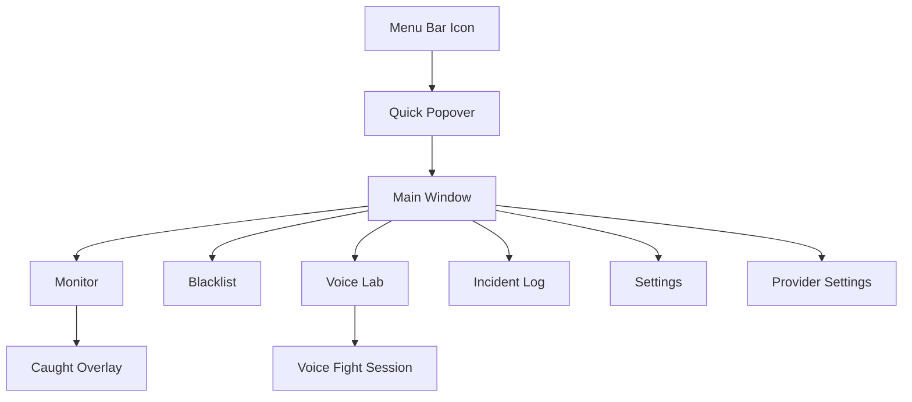

# Hunter Design Draft

版本：v0.2  
日期：2026-05-27  
状态：待审阅

## Design Positioning

Hunter 的界面要像一个“严肃工作工具误入整活片场”：整体保持 Mac 原生、克制、可信，但在抓包瞬间制造强冲击。不要做成营销落地页，也不要做成花哨聊天 App。第一屏就是可用的监督控制台。

关键词：

- Mac 原生菜单栏
- 工作仪表盘
- 抓包现场感
- 可录屏传播
- 强状态反馈
- 不假装严肃
- Provider 可配置
- 中英文双语

## Visual Direction

- 基础色：Graphite `#1F2328`, Ink `#0E1116`, Mist `#F4F6F8`
- 功能色：Action Green `#25C26E`, Warning Yellow `#F6B73C`, Roast Red `#E5484D`, Voice Blue `#3B82F6`
- 字体：SF Pro / system font
- 圆角：6-8px，保持桌面工具感
- 阴影：轻量，不做漂浮卡片堆叠
- 动效：150-240ms，抓包浮窗可使用快速弹入和轻微震动感

## App Structure



## Screen 1: Menu Bar Popover

目标：让用户快速知道 Hunter 是否正在盯着自己，并能一键暂停/恢复。

```text
┌────────────────────────────────────┐
│ Hunter                     ON      │
│ 正在监督 · 工作时段 09:30-12:00    │
├────────────────────────────────────┤
│ 今日抓包  7 次                     │
│ 摸鱼时长  18m 42s                  │
│ 最常命中  bilibili.com             │
├────────────────────────────────────┤
│ [暂停 25 分钟]   [打开控制台]       │
└────────────────────────────────────┘
```

状态：

- ON：绿色状态点，显示当前工作时段。
- PAUSED：黄色状态点，显示剩余暂停时间。
- OFF：灰色状态点，显示“未启动监督”。
- CAUGHT：红色状态点，短暂显示“刚抓到一次”。

## Screen 2: Main Monitor Dashboard

目标：第一屏直接完成“开始监督、看状态、看风险”的核心任务。

```text
┌──────────────────────────────────────────────────────────────┐
│ Hunter                     UI: 中文  AI: 中文   [暂停] [设置] │
├───────────────┬────────────────────────────┬─────────────────┤
│ 状态           │ 当前检测                    │ 今日战况         │
│ ● 正在监督     │ App: Chrome                 │ 抓包 7 次        │
│ 工作时段内     │ URL: bilibili.com/video...  │ 摸鱼 18m 42s     │
│               │ 命中规则: B站                │ 连续反驳 3 轮    │
├───────────────┴────────────────────────────┴─────────────────┤
│ 最近抓包                                                       │
│ 10:21  B站    “又来？你这工作状态像被 Wi-Fi 抽走了骨头。”       │
│ 10:07  微信    “摸鱼摸到聊天框里了是吧，键盘都替你心虚。”       │
│ 09:48  Steam   “你上班开 Steam 的勇气比你的 OKR 还完整。”      │
└──────────────────────────────────────────────────────────────┘
```

交互：

- “暂停”使用分段菜单：5 分钟、25 分钟、今天不监督。
- 当前检测区域每 1-2 秒刷新，但避免闪烁。
- 最近抓包支持复制文案。
- 主按钮状态必须和菜单栏状态一致。
- 顶部语言切换包含 UI 语言和 AI 输出语言，二者可以独立设置。

## Screen 3: Onboarding And Permissions

目标：把 macOS 权限解释清楚，但不写成长教程。

```text
┌────────────────────────────────────────────┐
│ 开始之前，需要 4 个权限                    │
├────────────────────────────────────────────┤
│ 辅助功能       检测当前正在使用的 App       │
│ 自动化         读取 Chrome/Safari 当前 URL  │
│ 麦克风         听你狡辩                    │
│ 通知           抓包时弹出提醒              │
├────────────────────────────────────────────┤
│ [打开系统设置]             [稍后设置]       │
└────────────────────────────────────────────┘
```

原则：

- 权限状态用明确图标和文字，不靠颜色单独表达。
- 未授权时功能可进入，但检测状态显示“缺少权限”。
- 自动化权限失败时提供浏览器 URL 检测降级说明。

## Screen 4: Blacklist Settings

目标：让用户快速把摸鱼目标加进去，规则足够简单。

```text
┌────────────────────────────────────────────────────────────┐
│ 黑名单                                                     │
├────────────────────────────────────────────────────────────┤
│ [网站] [App] [预设]                                        │
│                                                            │
│ 网站规则                                                   │
│ + bilibili.com             启用   冷却 5m    [编辑]        │
│ + youtube.com              启用   冷却 5m    [编辑]        │
│ + xiaohongshu.com          启用   冷却 3m    [编辑]        │
│                                                            │
│ [添加网站关键词或域名]                                     │
└────────────────────────────────────────────────────────────┘
```

规则字段：

- 名称
- 类型：Website / App
- 匹配方式：域名、URL 包含、App bundle id、App 名称
- 冷却时间
- 启用状态

预设包：

- 中文摸鱼平台：B站、小红书、微博、淘宝、抖音网页版。
- 海外内容平台：YouTube、Reddit、X、Twitch。
- 游戏娱乐：Steam、Epic、Battle.net。
- 聊天分心：微信、Telegram、Discord。

## Screen 5: Provider Settings

目标：用户能把 ASR、LLM、TTS 分别接到自己能负担、效果满意的 Provider；阿里云百炼只是默认测试模板。

```text
┌────────────────────────────────────────────────────────────┐
│ Provider Settings                                          │
├────────────────────────────────────────────────────────────┤
│ [ASR]                 [LLM]                 [TTS]          │
│ 阿里云百炼             阿里云百炼             阿里云百炼     │
│ paraformer-realtime-v2 qwen-turbo            cosyvoice...   │
│ 已连接                 已连接                 需要音色       │
│ [测试 ASR]             [测试 LLM]             [测试 TTS]     │
│                                                            │
│ Base URL        https://dashscope.aliyuncs.com/...          │
│ API Key         存储在 Keychain                             │
│ Model ID        qwen-turbo                                  │
│ Languages       中文 / English / Mixed                      │
│                                                            │
│ [新增 Custom Provider] [端到端测试] [保存]                  │
└────────────────────────────────────────────────────────────┘
```

交互：

- Provider 类型分为 ASR、LLM、TTS，三者独立配置。
- 内置模板仅填入 endpoint、model id、参数说明，不包含任何 API Key。
- API Key 输入后写入 Keychain；界面只显示“已存储/未配置”。
- 每个 Provider 显示能力标签：streaming、voice clone、custom voice、Chinese、English。
- 端到端测试按 `ASR -> LLM -> TTS` 顺序展示耗时和错误。

## Screen 6: Voice Lab

目标：把声音、角色和吐槽强度放在一个可试听的地方。

```text
┌────────────────────────────────────────────────────────────┐
│ Voice Lab                                                  │
├────────────────────────────────────────────────────────────┤
│ 角色          [毒舌同事 v]                                 │
│ 强度          温柔提醒 | 阴阳怪气 | 老板附体 | 破防模式     │
│ AI语言        跟随界面 | 中文 | English                     │
│ 音色          [默认男声 v] [试听]                           │
│ 音色复刻      [上传授权样本]                                │
│                                                            │
│ 预览场景       App: Chrome, URL: bilibili.com               │
│ 预览文案       “你又打开 B站？你这专注力比试用期还短。”       │
│                                                            │
│ [生成预览] [播放] [保存为当前角色]                           │
└────────────────────────────────────────────────────────────┘
```

强度边界：

- 温柔提醒：不使用粗口，不羞辱。
- 阴阳怪气：讽刺和调侃，不做人身攻击。
- 老板附体：压迫感更强，使用工作 KPI 语境。
- 破防模式：允许轻粗口，但必须明确用户主动开启，并保留安全过滤。
- English 输出：保留冲突感，但避免种族、性别、国籍等身份攻击；脏话强度同样受档位控制。

## Screen 7: Caught Overlay

目标：抓包瞬间适合录屏，信息短、狠、准。

```text
┌────────────────────────────────────────────┐
│ CAUGHT                                      │
│ bilibili.com                                │
│                                             │
│ “你又来了？今天的 KPI 是把推荐算法喂饱吗？” │
│                                             │
│ [按住 ⌥Space 反驳]        [认怂 5 分钟]     │
└────────────────────────────────────────────┘
```

交互：

- Overlay 显示 6-10 秒，可手动收起。
- TTS 播放中展示波形/播放进度。
- 用户按住快捷键时切换为录音状态。
- AI 回怼时展示 ASR 文本和回应文本。
- AI 输出语言为 English 时，同一浮窗结构展示英文文案，例如：“Back to YouTube? Bold choice for someone losing to a deadline.”

## Screen 8: Voice Fight Session

目标：让对喷有“回合制现场感”，但不做完整聊天软件。

```text
┌────────────────────────────────────────────┐
│ 语音对喷 · B站抓包                         │
├────────────────────────────────────────────┤
│ 你：我就看两分钟。                         │
│ AI：你上次也是两分钟，最后午饭都凉了。      │
│                                            │
│ 你：我是在找资料。                         │
│ AI：资料长得挺像鬼畜区首页。               │
├────────────────────────────────────────────┤
│ [按住说话] [结束回合] [复制名场面]          │
└────────────────────────────────────────────┘
```

限制：

- 默认最多连续 5 轮，防止用户把对喷变成新的摸鱼。
- 超过 5 轮后 AI 主动收束：“行了，别把吵架也摸成项目。”
- 支持保存“名场面”文案到日志。

## Screen 9: Language Settings

目标：界面语言和 AI 监督语言分开配置，适合中文用户使用英文对喷，或英文用户使用英文界面。

```text
┌────────────────────────────────────────────┐
│ Language                                   │
├────────────────────────────────────────────┤
│ Interface language   中文 | English        │
│ AI roast language    跟随界面 | 中文 | EN   │
│ ASR hint             自动 | 中文 | EN | 混合 │
│ Date/time format     跟随系统              │
└────────────────────────────────────────────┘
```

原则：

- 所有界面字符串必须来自 i18n key。
- AI prompt 明确传入 `target_language`，不要靠模型猜。
- Provider 音色列表需要标注支持语言。

## Empty, Error, And Privacy States

- 没有黑名单：显示“先选几个最容易背叛你的 App”。
- 不在工作时段：显示“现在不算摸鱼，Hunter 没上班”。
- 模型失败：显示“AI 监工断片了，已记录但未播报”。
- URL 权限失败：显示“Chrome/Safari URL 读取需要自动化权限”。
- 麦克风失败：显示“听不到你的狡辩，检查麦克风权限”。
- Provider 未配置：显示“语音链路缺少 LLM Provider，检测仍会继续但不会播报”。
- 英文输出不可用：显示“当前 TTS 音色不支持 English，请更换音色或 Provider”。
- 隐私说明入口始终可见：用户能看到哪些数据本地保存、哪些会发给模型 API。

## Design Acceptance Checklist

- 用户打开 App 后 5 秒内能判断当前是否正在监督。
- 所有按钮和状态都有真实功能映射，不出现装饰性假控件。
- 抓包 Overlay 在录屏中一眼可读，文案不被按钮遮挡。
- 黑名单配置不需要用户理解复杂规则引擎。
- 音色复刻入口必须先展示授权确认。
- ASR/LLM/TTS Provider 配置状态在开始监督前可见。
- 中英文文案长度都不能挤压按钮或状态区域。
- 任何 AI 失败都要有可见降级状态。
