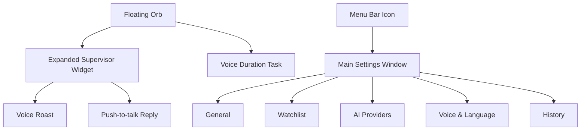

# Hunter Design Draft

版本：v0.9
日期：2026-05-30
状态：页面契约锁定，真实 DOM HTML 设计稿已生成

## Design Positioning

Hunter 的设计方向从“监控后台”改为 **Apple-like 的桌面监督小组件**。用户日常只看到一个低干扰悬浮球；用户可以直接按住快捷键说“监督我接下来的 40 分钟”创建时长任务；发现摸鱼时，悬浮球展开成小组件并直接语音吐槽。主窗口只在用户主动打开时出现，用来做设置、API Key、黑名单和历史记录。

这不是黑暗风格的 AI 控制台，也不是功能堆满的效率 Dashboard。它应该更像 macOS 原生工具：轻、静、精致、克制，有足够高级感，但抓包瞬间有戏剧性。

## Visual Direction

- 风格：macOS 原生、浅色、高留白、低饱和。Material 只用于 toast 或系统式窗口背景；抓包卡片和圆形悬浮球都不能出现半透明灰色外壳。
- 主色：Apple Blue `#007AFF`，抓包强调色 `#FF3B30`，成功色 `#34C759`。
- 背景：浅灰系统背景 `#F5F5F7`，窗口使用半透明白色。
- 字体：SF Pro / system font。
- 圆角：悬浮球 50%，小组件 18-22px，主窗口 16px。
- 阴影：柔和、真实，不做厚重暗色投影。
- 动效：悬浮球展开 180-240ms，状态变化轻微缩放，不做复杂炫技动画。

## 2026-05-30 Redesign References

本轮按 `vibe-product-builder -> PRD 页面契约 -> imagegen-to-html-design -> screenshot-to-code -> SwiftUI 实现` 重新走设计开发流程。`index.html` 是可批阅的真实 DOM/CSS 设计稿；PNG 只作为视觉参考，不作为整页背景。新参考图和 HTML 已保存到：

- `docs/design-prototype/redesign-2026-05-30/index.html`
- `docs/design-prototype/redesign-2026-05-30/design-system-board.png`
- `docs/design-prototype/redesign-2026-05-30/asset-sheet.png`
- `docs/design-prototype/redesign-2026-05-30/settings-general-watchlist-ai.png`
- `docs/design-prototype/redesign-2026-05-30/settings-voice-history-states.png`
- `docs/design-prototype/redesign-2026-05-30/floating-widget-states.png`
- `docs/design-prototype/redesign-2026-05-30/settings-window-reference.png`
- `docs/design-prototype/redesign-2026-05-30/floating-widget-reference.png`
- `docs/design-prototype/redesign-2026-05-30/component-board-reference.png`

采用内容：

- HTML Design Artifact：设置页五个 tab、悬浮组件状态、组件状态板、PRD 覆盖矩阵必须使用真实 DOM/CSS 重建，不允许只嵌入截图。
- Settings Window：左侧 196px sidebar、右侧自适应单列 section 列表、白色实体 settings card、低饱和蓝色选中态。
- Floating Widget：圆形头像 + 完整倒计时环，无方形底板、无绿点；快捷控制和抓包卡片都使用实体 white popover。
- Component Board：颜色、字号、间距、权限状态 pill、快捷键录制框、Provider 卡片、App picker row、声波状态。
- Asset Sheet：默认头像方向为极简墨镜眼睛；上传头像为圆形裁切；App 图标优先用系统/真实 App 图标，设计稿里的 glyph 只是占位。

不采用内容：

- 参考图里由模型误生成的动物头像、emoji 装饰和多余 “Change” 按钮不是产品需求；默认头像仍使用 Hunter 墨镜眼睛图标，所有可见控件以 `docs/PRD.md` 的 2A 页面契约为准。

## Information Architecture



## 主体验：悬浮监督组件

### 待机 / 监督悬浮球

默认只有一个桌面悬浮球，用户可以拖动到屏幕边缘。悬浮球不展示复杂数据，避免像监控器一样压迫。

```text
┌──────┐
│  H   │  48-64px
└──────┘
```

状态：

- 专注：圆形头像 + 边缘倒计时环；时长任务剩余越少，圆环越短。
- 暂停：圆形头像 + 暂停态边缘，不使用右下角状态点。
- 抓包：球体轻微放大并变为红色强调。
- 收音：圆形头像外侧显示绿色呼吸圆环，让用户明确感知正在收音。
- 播报：显示播放波形。
- 任务开始：轻量 toast 确认“40 分钟监督已开始”。
- 图标固定为圆形裁切，默认使用 Hunter 墨镜图标；用户可以在设置页上传头像并恢复默认。头像内容必须比倒计时环更小并收在圆环内侧，不要给图标增加方形、半透明或灰色底板；空闲态悬浮窗尺寸应贴合圆形图标但保留 4px 安全边距，边缘倒计时环必须完整显示，不能被裁切。

### 快捷控制菜单

用户点击悬浮球时，不打开主窗口，而是在原位置展开一个轻量快捷菜单，让桌面小组件承担大部分日常控制。

```text
┌──────────────────────────────┐
│ 快捷监督              14:58   │
│ 时长任务进行中                 │
│ 蓝色剩余进度条                 │
│ [15 分钟] [25 分钟] [40 分钟]  │
│ [暂停] [取消]                 │
│ 按住 Option + Space 对话       │
└──────────────────────────────┘
```

原则：

- 菜单只承载高频动作：开始 15/25/40 分钟监督、暂停/恢复、取消监督、展示当前倒计时。
- 倒计时进度条必须用 Apple Blue 展示剩余时间，背景轨道只作为低对比度参照，不能让用户误解哪一段才是剩余。
- “取消”表示立即结束当前时长任务并停止监督；不再提供语义模糊的“停止”按钮。
- 不展示 Provider、日志、模型状态等设置项。
- 菜单使用实体白色 popover 质感，不出现灰色半透明底板。
- 点击快捷分钟后立即创建时长任务；用户也可以按住快捷键说出监督时长完成同一件事。
- 快捷菜单和设置页读取同一个时长任务状态，倒计时、暂停和取消必须同步。
- 快捷菜单如果用户 6 秒内没有操作，需要自动收起；用户手动再次点击收起时，悬浮球必须保持原位置，不允许因为窗口尺寸变化而跳动。

### 语音创建时长任务

用户按住麦克风快捷键时，除了对喷，也可以直接创建一个监督时长任务：

```text
用户说：监督我接下来的 40 分钟
Hunter：40 分钟监督已开始
```

交互原则：

- 不打开主窗口。
- 悬浮球外侧显示绿色呼吸圆环，确认正在收音。
- 解析成功后出现 2-4 秒确认 toast，toast 使用实体白色 popover 背景，不出现灰色半透明矩形外壳，并自动消失。
- 悬浮球进入倒计时监督态。
- 如果 Voice Agent 判断语音不是监督控制命令或时长任务，悬浮球保持轻量语音对话体验：先显示用户转写，再直接显示同一次 Agent 返回的 Hunter 短回应并播报；回应沿用当前人设、强度、语言和音色，不打开主窗口，也不写入抓包历史。
- 普通语音对话需要按当前监督状态调整口吻：未开启监督或无时长任务时，Hunter 可以延续人设对话、鼓励或轻度吐槽，但不能装作正在抓包、正在监督违规或即将关闭目标。
- Hunter 的回应 toast 与 TTS 保持同一生命周期：TTS 成功开始播放后才出现回应文字，播放期间保持可见，播放结束后收起；收音、识别、思考状态在语音链路 busy 期间不得被固定倒计时清掉。
- 支持中文和英文：“监督我接下来的 40 分钟” / “Keep me focused for 40 minutes”。
- ASR 命令识别默认使用自动/中英混合，不跟随 AI 监督语言；时长解析支持“三十五分钟”“半小时”“一个半小时”等常见口语。

### 语音调整设置

用户按住麦克风快捷键时，也可以直接调整少量高频设置。体验仍然发生在悬浮球附近：识别成功后出现 2-4 秒实体 toast，不打开主窗口，不展示内部模型状态。

```text
用户说：帮我取消这次监督
Hunter：监督已取消

用户说：换一个女生音色
Hunter：当前音色已改为 冰糖

用户说：允许强制关闭
Hunter：已允许强制关闭
```

交互原则：

- 命令执行必须轻量、可逆或低风险；高风险设置只提示或进入设置页，不在桌面上直接静默执行。
- 可直接执行的设置包括监督开始/暂停/恢复/取消、时长任务调整、吐槽强度、监督角色、监督语言、界面语言、粗口开关、悬浮球显示、当前 Provider 已知音色。
- 语音识别成功后，toast 只展示结果，不解释 parser、LLM、Provider 或命令 schema。
- 语音转写后始终进入单次 LLM Voice Agent；抓包卡片、当前 incident、监督状态和最近对话都作为上下文提供给模型，而不是由客户端硬分流。
- Agent 返回 `type=tool_call` 时只允许使用受限工具名和参数，本地 allowlist executor 校验后才更新设置；Agent 返回 `type=chat` 时直接播报同一个结构里的 `spoken`，不再二次请求普通聊天模型。
- 抓包对话中也允许明确的低风险设置/控制工具调用；如果最新语音只是反驳、情绪表达、玩笑或含糊抱怨，Agent 应继续当前 incident 的聊天回复。
- 工具调用和普通聊天都必须带 `spoken`，用于同步 toast 与 TTS；如果本地校验拒绝工具调用，桌面上播报本地校验结果。
- 开发/调试时允许通过 CLI 输入一句话并查看 Voice Agent 的 `type/tool/args/spoken`，避免每次都依赖真实麦克风复现。
- 不要用语音直接录入 API Key、创建声音克隆、清空历史或大范围编辑黑名单；这些操作需要设置页中的明确输入或确认。

### 时长任务完成

时长任务到点结束时，悬浮球给出短 toast 并播放一句总结语音：

- 0 次抓包：彩虹屁夸奖。
- 1-3 次抓包：轻度鼓励，承认中间摸鱼但强调完成了。
- 4 次及以上：吐槽式总结；如果用户允许粗口，可以更狠、更脏一点，但火力只指向摸鱼行为和拖延借口，仍不攻击受保护属性。

这条语音使用当前云端 TTS Provider，不回退到系统朗读。
总结文案与总结语音同步出现：音频开始时展示，音频结束后收起，避免先看到整句文字再等待声音。

### 抓包展开小组件

命中黑名单时，Hunter 先在后台完成第一句 LLM + TTS 准备；音频可播放后，悬浮球展开成一个 320-360px 的桌面小组件并同步播报，避免用户先看到等待状态。

```text
┌────────────────────────────────────┐
│ 抓到你在看 YouTube            10:21│
│                                    │
│ “又打开 YouTube？离截止时间更近了， │
│ 你倒是挺稳。”                      │
│                                    │
│  语音波形                           │
│ [按住 Option Space 对话] [暂停]      │
└────────────────────────────────────┘
```

原则：

- 小组件不做大红大黑警报风，只用红色作为精准强调。
- 小组件不展示 LLM、ASR、TTS、Provider、模型组合、合成中或播放中等内部状态。
- 小组件背景使用实体白色/系统 popover 色，不使用灰色半透明外圈；阴影必须极轻，不能形成一圈灰色雾面背景。
- 文案区域最多 3 行，避免遮挡桌面。
- LLM 可以读取完整网页标题来判断用户具体在看什么；抓包文案和 TTS 播报必须压成一句精准短句，不原样朗读完整网页标题、URL、长 ID 或 query string。
- 支持中英文文案，英文长句需要自动换行。
- 用户按快捷键或卡片按钮反驳时，小组件切换为 listening 状态；卡片按钮只展示“按住 {用户设置的快捷键} 对话 / Hold {shortcut} to talk”，按下开始录音、松开发送，不出现“连续对喷”等内部机制文案。
- Hunter 播报回击后，卡片保持同一对话上下文并等待用户再次按住快捷键；不要在后台自动开始下一轮录音，避免用户第二次按键时出现抢麦克风或状态冲突。
- 声波条在 Hunter 播放 TTS 和用户按住录音时持续起伏；转写、思考、空闲时保持静态，避免假装一直在听。
- 抓包卡片在播报完成后等待用户几秒；如果用户没有按住回击或点击暂停，自动收起。
- 背景使用干净的实体 macOS popover 质感，不再使用大面积浅色透明 material 色块。

## 主窗口

主窗口是用户主动打开才看到的地方。不要放复杂实时监控大屏，只做轻设置。

### 布局

```text
┌──────────────────────────────────────────────────────────────┐
│                         Hunter                               │
├──────────────┬───────────────────────────────────────────────┤
│ 通用         │ 悬浮组件                                      │
│              │ 头像 / 显示悬浮球 / 麦克风快捷键               │
│ AI 配置      │ 厂商下拉、可编辑模型、API Key、连接测试        │
│ 声音         │ 语言、角色、音色、声音克隆                    │
│ 历史         │                                               │
└──────────────┴───────────────────────────────────────────────┘
```

主窗口设置页遵循统一的 macOS 设置布局：

- 左侧 sidebar 固定 196px 宽，导航项整行可点，选中态使用低饱和蓝色背景。
- General、Watchlist、AI、Voice、History 五个 Tab 必须复用同一份 sidebar 模板：左上角红黄绿窗口控制点、Hunter 图标、Hunter 名称、副标题、导航顺序、导航间距都保持不变；切换 Tab 时只允许当前导航项的选中态变化。
- Sidebar 字体规范：品牌名 13px/17px semibold，副标题 11px/14px regular；导航中文主标签 13px/18px medium，英文副标签 12px/16px regular；单个导航项高度 40px，上下间距 4px，选中态圆角 9px。
- 右侧内容使用单列 section 列表并充分利用可用宽度；不要因为 760px 固定窄列造成大面积空白。
- 内容区不重复展示当前 sidebar 已选中的页面大标题，例如选中 General 后右侧不要再出现一个“通用”大标题。
- 右侧顶部横栏在 General、Watchlist、AI、Voice、History 五个 Tab 中保持同一高度、同一内边距和同一标题排版；顶部不得出现通知、个人头像或账号中心入口。设置窗口不设计全局底部操作条，避免重复按钮干扰内容。
- 每个设置项使用上下结构：section 标题和说明在卡片外上方；具体开关、输入框、列表、按钮放在下面的白色卡片里。
- 卡片内部可以横向排列少量控件，但不得把“标题说明”和“控件区”做成左右分栏。
- 同一卡片内的多行设置必须使用统一的 1px 浅灰分割线；General、AI、Voice、History、Watchlist 不得各自使用不同的行距、描边和卡片质感。
- 输入表单使用上标签字段，而不是窄侧标签；AI 页让用户选择厂商、填写 API Key，并在模型 ID 可编辑下拉中选择厂商推荐模型或自定义输入模型名。用户输入自定义模型名或改动 Provider 字段后，“更新配置”按钮必须可点击，点击后展示成功或失败 toast，不能让用户填完后没有明确提交反馈。内置厂商的 Base URL 与连接参数用摘要展示，自定义厂商额外显示厂商名和 Base URL。
- 测试按钮和预设按钮使用自适应网格/横向滚动，不硬挤成一排。
- Toggle 带文字时必须保证不换行；窄控件区使用文字 + 独立 switch。
- 设置页不提供开始、暂停、结束时长监督的运行控制；时长任务只通过悬浮球快捷菜单、菜单栏或语音指令启动与管理。
- 通用页不设计固定工作时段或自动工作日程。
- 快捷键设置只展示一个可录制输入框；点击后同一个框进入录制态，不要并排显示“Option + Space”和“Press keys”两个框。

### General

- 悬浮球显示位置和尺寸。
- 悬浮球头像：固定圆形裁切，上传自定义头像，恢复默认头像。
- 麦克风快捷键设置：默认 `Option + Space`，用户点击快捷键输入框后直接按新的组合键或单键完成录制；输入框内以 `Key + Key` 或单键形式展示，抓包卡片和全局监听必须读取同一份配置。单独的修饰键也必须可录制和可用，例如 `Right Option`。
- 权限设置：只展示当前主链路真正需要或直接使用的权限：麦克风、浏览器自动化、通知。每条权限只展示名称、说明和一个可点击状态 pill；未开启时点击状态直接打开系统设置或授权弹窗。通知这类可选增强只在标题或说明里标注“可选”，状态 pill 不得显示“可选”，必须显示“已允许”或“未开启”等真实状态。辅助功能不出现在通用权限区，除非未来某个明确功能真实依赖它。
- 开机启动。

### Watchlist

- 网站黑名单。
- App 黑名单。
- 本机 App 选择器：读取 `/Applications`、`~/Applications` 和 `/System/Applications` 下的 `.app`，搜索框下拉展示未添加 App 的搜索结果，用户一键添加；已添加列表只展示已加入黑名单的 App。
- 常用预设包。
- 每条规则只显示名称、类型、匹配内容、启用状态和删除操作；不设计冷却时间字段。

### AI Providers

保持三段完全独立配置，不做全局“基础配置”联动：

```text
ASR  [云端 API / 本地模型]  厂商下拉 / 模型可编辑 / API Key / SenseVoice Small / 自定义厂商名与 Base URL
LLM  厂商下拉  模型可编辑  API Key  自定义厂商名与 Base URL
TTS  厂商下拉  模型可编辑  API Key  自定义厂商名与 Base URL
```

用户可以让 ASR、LLM、TTS 分别使用不同厂商。ASR/LLM/TTS 的厂商下拉只展示厂商名，不把厂商和推荐模型拼成一个选项；模型 ID 是独立可编辑下拉字段，先给出当前厂商官方文档中的常用和较新模型建议，用户仍可直接输入自定义模型名。模型 ID、厂商名、Base URL、鉴权方式或 API Key 环境变量名变化后，“更新配置”按钮进入可点击状态；点击成功后用 toast 和状态文本反馈，失败时提示缺失字段。每类都追加“自定义厂商”，自定义时显示厂商名、Base URL、模型 ID 和 API Key。API Key 通过设置页写入本机 Application Support `.env.local`，不提交仓库、不展示明文、不进入日志。内置厂商的 Base URL、鉴权 scheme、headers、region、语言提示和流式能力由 adapter 默认处理并在摘要中说明。连接测试需要展示成功和失败两种状态，成功显示延迟和返回语言，失败显示错误摘要。

ASR 默认展示云端 API 表单，让用户先填写自己的 Provider/API Key；旧版本保存过本地 ASR 的用户，在迁移到当前版本时会一次性回到云端 API，之后用户再手动切换本地模型则按用户选择保留。用户切换到本地模型模式后，只展示模型名称、能力说明、来源和“下载到本机”按钮。模型保存在 Hunter 的 Application Support 目录，不混进项目仓库，也不上传用户音频。本地 ASR 下载后可直接用于语音时长任务。若历史配置选择了本地 ASR 但模型或 runtime 未就绪，启动时回到云端 API，避免用户点击麦克风后空转。TTS 不再提供本地模型模式，只使用云端 Provider。

开始监督、开始时长任务、麦克风对话和 Provider 测试入口都必须先做 ASR/LLM/TTS 配置校验。任一云端配置缺厂商、Base URL、模型 ID、API Key 名称或实际 API Key，或本地 ASR 未下载/未安装 runtime 时，展示系统弹窗，列出缺失项，并提供“去 AI 配置”入口；不得只在按钮上转圈等待。

### Voice & Language

- 界面语言：中文 / English，使用下拉菜单。
- AI 监督语言：使用下拉菜单，默认跟随界面 / 中文普通话 / English；当当前 TTS Provider 支持方言/口音风格时追加粤语/广东话、四川话、东北话、河南话等能力项。
- 监督语言影响 LLM 输出和 TTS 语言提示；方言选项的文本基础语言仍按中文处理，由 TTS adapter 注入方言风格指令和音频 tag。若模型返回明显错误语言，需要使用目标语言兜底短句，不能让 English 模式继续播中文抓包。
- 角色：学习监督、工作监督、自定义。
- 自定义人格提示词：最多 300 字，只在用户选择“自定义”角色时展示；只进入 LLM 角色设定，TTS 不解析人格，只朗读 LLM 输出。
- 强度：温柔、鼓励、正经、凶狠。
- “允许强制关闭”是人格设定里的独立开关，不属于吐槽强度。开启后需要先完成抓包弹窗和 TTS 播报，播报文案末尾带“我现在就把它关掉”语义，播放完成后再执行本地阻断动作：网站规则关闭当前浏览器标签页，App 规则请求退出当前前台 App；不设计断网、锁屏、远程控制或强杀。
- 音色：使用下拉选择，不让用户手填 voice id。默认随 TTS 厂商模板和当前模型变化，MiMo 普通合成模型 `mimo-v2.5-tts` 使用 `白桦` 等预置音色，MiMo `mimo-v2.5-tts-voiceclone` 只展示已授权样本创建的克隆音色，不显示普通 TTS 预置音色；OpenAI 使用 `coral`；阿里 `cosyvoice-v3-flash` / `cosyvoice-v3-plus` 可使用系统音色 `longanyang`，但正式推荐的阿里 `cosyvoice-v3.5-flash` / `cosyvoice-v3.5-plus` 官方无系统音色，首次使用必须先通过声音设计或声音克隆创建 `voice_id`。声音设置中“声音设计”位于“声音克隆”上方，只展示一个用户输入表单：音色名称、声音描述提示词和生成按钮；音色名称必填，缺失时红框提示并 toast；提示词输入框用灰色 placeholder 给出示例，聚焦输入时 placeholder 消失，指导用户描述性别、年龄段、音调、语速、情绪、声音特点、用途和清晰干净要求，不提供预置角色包或批量生成入口。连接 TTS Provider 后可刷新可用音色，克隆/设计完成的音色进入同一个下拉，并在音色卡片中展示列表。音色卡片提供“输出音量”滑块，默认 100%，范围 50%-250%，用于本地播放增益；“试听音色”和真实抓包/对喷/总结播报必须使用同一个输出音量。音色按钮文案使用“试听音色”，点击后必须播放当前音色的短样例；若当前模型需要自定义 `voice_id`、授权样本或其他模型专属音色但尚未选择有效音色，应直接提示用户先设置音色，不发起无效 TTS 请求。结果状态用带图标的状态条和正文级字号，不用很小的 footnote 文本。阿里 CosyVoice 合成默认以干净复现音色为优先，不默认启用 SSML 或强情感 `instruction`；只有明确方言/口音等需要时才传入短指令。
- 克隆声音：按当前 TTS Provider 与模型驱动，不在声音克隆卡片里二次选择 Provider。TTS 厂商、模型或 API Key 未配好时，克隆卡片展示收起/锁定说明；TTS 已配好但厂商或模型未适配时，展示未适配说明和去 AI 配置调整的提示。当前可直接创建的流程开放小米 MiMo inline 授权样本、阿里 CosyVoice `voice-enrollment` 和阿里 `qwen3-tts-vc*` voice enrollment；正式推荐用户选择 `cosyvoice-v3.5-flash`，Hunter 将本地样本上传为百炼临时 `oss://` URL，再创建 CosyVoice `voice_id` 并查询到 `OK` 后保存。支持时展示授权确认、上传样本、录制样本、克隆名称、开始克隆、进度和成功状态，不再展示单独状态行或克隆模式行。已上传样本显示在操作区附近；克隆名称默认留空，使用灰色占位提示；用户点击开始克隆但未填写名称时，名称输入框必须出现红色未填写提示。只有用户确认拥有该声音授权后，上传、录制和开始克隆按钮才可用。对返回长期 `voice_id` 的平台显示该 id，并按创建时的 TTS 模型做兼容过滤；对 MiMo inline sample clone 显示本机授权样本引用，并把克隆音色放进同一个音色下拉。点击“设为当前音色”成功后展示 toast/状态反馈，并清空授权、样本、克隆名称、进度和成功态，方便继续创建下一个音色。安全提示保持简短：不支持复刻公众人物或未经授权的第三方声音。

### History

历史记录只展示对用户有用的轻量信息：

- 时间。
- 命中对象。
- 摸鱼时长。
- AI 名场面。

不做复杂图表，不做“数据驾驶舱”。

## HTML Prototype

当前 HTML 原型位于：

- `docs/design-prototype/redesign-2026-05-30/index.html`
- 生成图参考目录：`docs/design-prototype/redesign-2026-05-30/`

重要边界：

- HTML 不能把生成图作为整页背景；生成图只放在“生成图视觉参考”区域。
- HTML 不展示 macOS 桌面壁纸、系统菜单栏、Dock。
- 实际产品界面只包含 Hunter 悬浮球、抓包小组件、时长任务 toast、设置主窗口和菜单栏状态入口。

原型需要体现：

- Apple-like 浅色、高级、简约风格。
- 桌面悬浮球和展开小组件是第一视觉。
- 支持语音创建时长监督任务的 toast/确认态。
- 主窗口只做轻量设置。
- Provider 可配置，但默认折叠为三行。
- 中英文界面和 AI 语言可切换。
- 主窗口导航使用左侧竖向 sidebar；顶部不做横向菜单。

## Design Acceptance Checklist

- 第一眼看到的是悬浮监督器，不是后台 Dashboard。
- 主窗口不超过 5 个侧边栏入口。
- Provider 配置默认收起，不压迫普通用户。
- 语音时长任务入口可以不打开主窗口完成。
- 中英文文案在小组件里都不溢出。
- 抓包状态有戏剧性，但不破坏整体高级感。
- 界面整体接近 macOS 原生软件，而不是暗黑 AI 工具。
