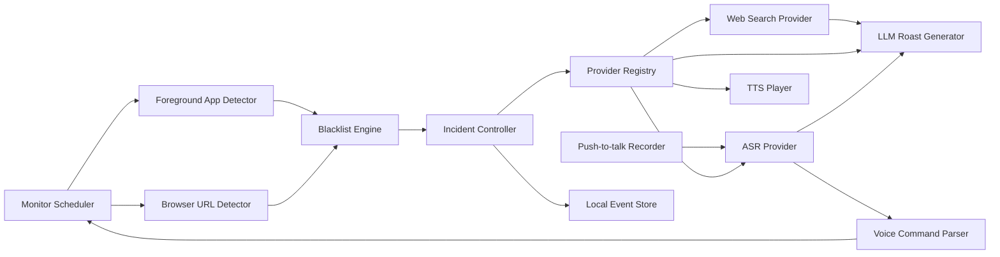

# Hunter PRD

版本：v0.8
日期：2026-05-30
状态：实现中，MVP 验收推进

## 0. Discovery Notes

已知输入：

- 目标平台：Mac 桌面端。
- 核心玩法：工作时间内通过桌面悬浮球/小组件监控摸鱼网站/App，命中后 AI 语音高强度吐槽。
- 语音互动路线：`ASR -> LLM -> TTS`；ASR 支持云端 API 和本地模型，TTS 统一走云端 Provider。
- ASR、LLM、TTS 均需要做成用户可配置 Provider；当前本机 LLM 测试链路先用 DeepSeek `deepseek-v4-flash`。
- ASR 要提供本地模型下载入口；首选本地 ASR 为 SenseVoice Small INT8。
- TTS 需要支持用户指定云端音色 ID；本地 TTS 方案已否掉，MVP 不再提供本地 TTS 下载、Qwen worker 或本机声音克隆入口。
- 软件界面需要支持中英文。
- AI 监督和语音对喷内容需要支持中文和英文。
- 悬浮球需要支持语音快速创建时长任务，例如“监督我接下来的 40 分钟”。
- 当前阶段产出可运行原生 macOS App、PRD、设计稿、技术评估、验收清单和可打包 DMG。

待确认问题：

- 第一批黑名单是否以中文互联网内容平台为主，还是同时覆盖海外网站和游戏类 App？
- 吐槽“脏话”边界要做到什么程度：轻粗口、强羞辱、还是只允许用户自定义角色包？
- 第一版是否需要真的阻断摸鱼行为，还是只做语音抓包和日志？
- 首批 Provider 模板除阿里外，是否需要预置 OpenAI、火山引擎、腾讯云、MiniMax 等？

## 1. Executive Summary

**Problem Statement**  
普通效率工具太严肃、太弱提醒，用户容易忽略；而“被 AI 当场抓包并开骂”的强冲突体验更容易制造自律压力和传播素材。

**Proposed Solution**  
开发一个 Mac 端轻量 AI 监工应用。主体验是桌面悬浮球/小组件：用户配置工作时间、黑名单和 ASR/LLM/TTS Provider 后，Hunter 在后台检测前台 App、浏览器 URL 与标签页标题；一旦命中摸鱼目标，先在后台调用 LLM 和 TTS 准备第一句吐槽音频，音频可播放后再展开悬浮小组件并同步播报。用户可开启联网搜索增强，让 Hunter 用当前页面标题/域名取少量搜索摘要，使吐槽更贴合用户正在看的内容。用户可以用快捷键或悬浮卡片按钮语音反驳，系统通过 ASR 转写后继续生成语音回应。主窗口只承载设置、Provider、历史记录和语言/音色配置。

**Success Criteria**

- 黑名单命中后 2 秒内出现可见抓包反馈，5 秒内完成首句语音播报。
- 悬浮球常驻桌面时不遮挡主要工作内容，默认尺寸 <= 64px；抓包展开态宽度 <= 360px。
- Chrome/Safari/App 三类检测在本机测试中命中准确率 >= 95%。
- 用户完成从安装、授权、配置黑名单到启动监控的时间 <= 3 分钟。
- 日常 30 次抓包 + 10 分钟语音反驳的云端成本目标 < 1 元/天。
- MVP 内部测试中，80% 以上的抓包事件能产生可用于录屏传播的短句。
- ASR/LLM/TTS Provider 可以分别切换，用户可以用自己的 API Key 跑通完整语音链路。
- 界面中英文切换覆盖 100% MVP 可见文案；AI 监督语言可独立选择中文或英文。

## 2. User Experience & Functionality

### User Personas

- 内容创作者：想拍“AI 监督挑战”“办公室自律实验”类视频，需要强节目效果。
- 自律困难用户：希望通过羞耻感、冲突感和声音提醒减少摸鱼。
- AI 工具玩家：想体验可对喷的桌面 AI 角色，不只是普通提醒工具。

### Core User Flow

1. 用户首次打开 Hunter。
2. 完成权限引导：辅助功能、自动化、麦克风、通知。
3. 设置工作时间。
4. 添加网站/App 黑名单。
5. 选择界面语言和 AI 监督语言。
6. 配置 ASR/LLM/TTS；默认 LLM 使用 DeepSeek API，默认 ASR 使用本地 SenseVoice，TTS 使用云端 Provider。
7. 选择 AI 监工角色、吐槽强度和 TTS 音色。
8. 点击“开始监督”，桌面出现轻量悬浮球。
9. 用户也可以按住快捷键说“监督我接下来的 40 分钟”，Hunter 解析出时长并立刻开启一个 40 分钟 Focus Session。
10. 用户进入黑名单 App 或网站。
11. LLM + TTS 准备好第一句音频后，悬浮球展开成小组件并同步开始语音吐槽。
12. 用户按住快捷键语音反驳。
13. Hunter 转写用户语音，生成反击文案，并继续播报。
14. 主窗口历史记录展示抓包次数、摸鱼时长、命中目标和经典语录。

### User Stories And Acceptance Criteria

**Story 1：配置工作时间**  
As a user, I want to define my work schedule so that Hunter only supervises me during the periods I care about.

Acceptance Criteria:

- 支持添加多个工作时间段。
- 支持工作日/周末开关。
- 工作时间外不触发语音吐槽。
- 临时暂停后不清空原配置。

**Story 2：配置网站和 App 黑名单**  
As a user, I want to define websites and apps that count as slacking so that Hunter can detect meaningful violations.

Acceptance Criteria:

- 支持按域名、URL 关键词、App 名称配置。
- 支持快速添加常见平台预设。
- 支持每条规则启用/停用。
- 命中日志能展示具体命中的规则。

**Story 3：被抓包时收到语音吐槽**  
As a user, I want Hunter to roast me immediately when I slack off so that the interruption feels dramatic and hard to ignore.

Acceptance Criteria:

- 监督中桌面显示一个可拖动悬浮球或小组件。
- 未命中黑名单时，悬浮球保持低干扰状态，只显示监督状态；时长任务进行中用圆形头像边缘倒计时环表示剩余时间，不使用右下角红黄绿状态点，也不允许出现方形半透明窗口底板；头像必须收在倒计时环内侧，倒计时环必须完整显示，不能被窗口边缘裁切。
- 用户点击悬浮球时可展开快捷控制菜单，直接开始 15/25/40 分钟监督、查看当前倒计时、暂停/恢复、停止或取消监督，不需要打开主窗口。
- 命中黑名单后先在后台准备吐槽音频；音频准备好后，悬浮球在原位置展开成小组件并开始播报。
- 小组件只展示抓包对象、吐槽文案和用户可操作按钮，不展示 LLM、ASR、TTS、Provider、模型组合或“正在播放中”等内部状态；卡片背景必须是实体 popover 质感，不出现灰色半透明外圈。
- 抓包小组件在播报和用户录音期间显示动态声波；没有播放或录音时声波静止。
- 抓包小组件播报结束且用户几秒内没有继续操作时自动收起，不要求用户手动关闭。
- 命中黑名单后生成一条 10-25 秒内可播完的吐槽。
- 每次吐槽包含命中对象、当前工作状态和角色语气。
- 悬浮球头像固定为圆形裁切，支持用户上传自定义头像并恢复默认头像，不允许头像超出圆环，也不允许出现方形或半透明底板。
- 支持吐槽强度：温柔提醒、阴阳怪气、老板附体、破防模式。
- 同一网站连续命中时有冷却时间，避免每秒重复播报。

**Story 4：语音对喷**  
As a user, I want to talk back to Hunter so that the product feels like a live confrontation rather than a static reminder.

Acceptance Criteria:

- 用户可通过快捷键或界面按钮进入录音。
- 用户按住对话快捷键时，悬浮球外侧出现绿色呼吸圆环，明确反馈正在收音。
- 默认对话快捷键为 `Option Space`，用户可以在设置页录制修改；抓包卡片按钮展示“按住 {当前快捷键} 对话 / Hold {shortcut} to talk”，并按“按下开始录音、松开发送”执行。
- ASR 返回后，界面展示用户转写文本。
- LLM 根据用户狡辩内容继续回应。
- TTS 播报回应，且日志保存这一轮对话。
- Hunter 播报完成后保持同一抓包上下文，等待用户再次按住快捷键继续下一轮；不得后台自动抢麦克风导致手动按键冲突。
- ASR/LLM/TTS 任一失败时给出可见降级状态；诊断细节只出现在设置/诊断区域，不塞进抓包小组件。

**Story 4.1：语音创建时长监督任务**  
As a user, I want to quickly tell Hunter how long to supervise me so that I can start a focused work session without opening the main window.

Acceptance Criteria:

- 用户按住快捷键后可以说：“监督我接下来的 40 分钟”“帮我开始一个 15 分钟的监督任务”“盯我 25 分钟”“keep me focused for one hour”。
- Hunter 使用 ASR + duration parser 解析出时长和意图。
- 解析成功后，悬浮球显示确认态，例如“40 分钟监督已开始”；确认 toast 使用实体 popover 背景，不出现半透明灰色矩形底板，并在数秒后自动消失。
- 时长任务期间，黑名单命中会触发抓包吐槽；时长结束后自动回到普通待机/按工作时间监督。
- 解析不确定时，悬浮球展示轻量确认，而不是打开主窗口。
- 时长任务可暂停、延长、结束，并写入历史记录。

**Story 5：查看今日抓包记录**  
As a user, I want to review what happened today so that I can use the data as 自律反馈 or video 素材.

Acceptance Criteria:

- 展示今日抓包次数、摸鱼总时长、Top 黑名单对象。
- 展示每次抓包时间、命中对象、AI 吐槽文案。
- 支持一键清除本地日志。

**Story 6：配置模型 Provider**  
As a user, I want to configure my own ASR, LLM, and TTS providers so that I can choose the cost and voice quality that fits me.

Acceptance Criteria:

- ASR、LLM、TTS、Web Search Provider 可独立配置和启用。
- 每类 Provider 的 MVP UI 只展示四个必填项：Provider、Base URL、Model、API Key。
- ASR 额外支持“本地模型 / 云端 API”模式切换；选择本地模型时展示推荐模型、来源和下载按钮。
- 本地 ASR 使用 SenseVoice Small INT8，下载后可在本机完成短音频识别，不上传用户录音。
- TTS 仅走云端 Provider，声音页只配置云端音色 ID；云端音色克隆/音色设计后续由对应 Provider adapter 接入。
- API Key 进入本机 `Application Support/Hunter/.env.local` 和进程内缓存，不提交仓库、不进入日志；运行热路径不访问 Keychain，避免系统钥匙串授权弹窗。
- 提供“测试 ASR”“测试 LLM”“测试 TTS”“测试搜索”“端到端测试”五类检查。
- 内置 DeepSeek LLM、阿里云百炼云端 ASR/TTS、本地 SenseVoice ASR、Brave Search 模板；用户可以新增 OpenAI-compatible 或 custom HTTP provider。
- 任一 Provider 未配置时，监督检测仍可运行，但语音链路显示明确缺失状态。

**Story 7：中英文界面和监督语言**  
As a user, I want the app and AI supervisor to work in Chinese or English so that different users can use Hunter in their own language.

Acceptance Criteria:

- UI 支持 Simplified Chinese 和 English。
- AI 监督语言可选择：跟随界面、中文、English。
- ASR 语言提示由 provider/local adapter 默认处理；后续高级模式再展示自动、中文、English、中英混合。
- LLM prompt 必须显式传入目标输出语言。
- TTS 音色以云端 Provider 的 voice id 为准，默认 `longanyang`。
- MVP 不提供本地声音克隆入口；云端克隆/音色设计进入后必须要求用户确认授权，且不复刻未授权第三方声音。

### Non-Goals

- 不做老板/管理员远程监控员工。
- 不做隐身后台采集或不可关闭监控。
- MVP 不做跨设备同步、团队排行、远程管理后台。
- MVP 不做强制断网、强制关闭 App 或系统级拦截。
- MVP 不做公开视频自动生成，只提供适合录屏的 UI 和日志。
- MVP 不内置任何云端 API Key，也不提供代付模型额度。

## 3. AI System Requirements

### Tool Requirements

- ASR：实时或准实时语音识别，支持普通话、英语、中英混合、口语化表达、短音频低延迟。
- LLM：中英文吐槽、角色扮演、上下文记忆、粗口边界控制、低成本。
- TTS：中英文自然语音，支持指定音色；优先支持音色复刻或音色设计。
- Web Search：可选增强，只用页面标题/域名发起查询，返回少量搜索摘要给 LLM，不上传完整浏览历史。
- Provider 层：统一封装 `transcribe(audio, options)`, `generateRoast(context, options)`, `speak(text, voice, options)`, `search(query, options)`。
- Provider 配置层：支持内置模板、自定义 provider、连接测试、启停、成本备注和能力标签。

### Prompt Requirements

LLM 输入最少包含：

- 命中对象：App 名称、URL 域名或规则名。
- 页面上下文：浏览器标签标题、URL、可选搜索摘要。
- 当前阶段：首次抓包、连续摸鱼、用户反驳。
- 用户配置：吐槽强度、角色、禁用词、是否允许粗口、输出语言。测试阶段若用户已允许粗口，prompt 应明确要求使用普通脏话增强节目效果，但仍禁止仇恨辱骂、真实威胁和受保护属性攻击。
- Provider 能力：模型名称、语言支持、TTS 音色语言、是否支持流式。
- 安全边界：不攻击受保护属性，不鼓励自伤，不输出真实威胁。

### Evaluation Strategy

- ASR：20 条用户反驳样本，普通话转写字错率目标 <= 10%。
- ASR：20 条英文反驳样本，英文转写词错率目标 <= 15%。
- LLM：100 条命中场景，人工评分“好笑/有冲突/不越界”，通过率 >= 80%。
- LLM：中英文输出语言遵循率 >= 98%。
- TTS：10 个默认音色 A/B 测试，选择清晰度、情绪表现、延迟综合最优的 3 个。
- 端到端：模拟 30 次抓包，平均首句播报延迟 <= 5 秒。

## 4. Technical Specifications

### Architecture Overview

### macOS Components

- Menu Bar Controller：展示状态、开始/暂停、快速入口。
- Settings Window：工作时间、黑名单、声音、角色、隐私设置。
- Monitor Service：定时检测前台 App 和浏览器 URL。
- Incident Controller：处理命中、冷却、文案生成、播报和日志。
- Voice Session：负责录音、ASR、LLM 回应、TTS 播放。
- Voice Command Parser：解析“监督我接下来的 40 分钟”等时长任务意图。
- Focus Session Manager：管理临时时长监督任务、倒计时、暂停、延长和结束。
- Provider Registry：保存 ASR/LLM/TTS 的用户配置、内置模板和连接状态。
- Localization Manager：管理 UI 语言、AI 输出语言和 provider 语言提示。
- Local Store：保存配置、规则、日志和音色元数据。

### Integration Points

- macOS 权限：辅助功能、自动化、麦克风、通知。
- Chrome/Safari：通过脚本读取当前标签 URL；监控循环只做静默自动化权限检查，未授权时不主动弹系统授权框。
- 云端模型 API：ASR、LLM、TTS。
- Local Secret Store：保存 API Key 引用和本机 `.env.local` 密钥。
- i18n 资源：中英文 UI 文案、默认角色 prompt、默认吐槽模板。

### Security & Privacy

- 默认只上传被抓包时的最小上下文，不上传完整浏览历史。
- 用户反驳音频仅用于 ASR，默认不保留原始音频。
- 本地日志默认可清除。
- 音色复刻需要显式授权确认，并记录授权状态。
- 调试日志不得打印 API Key、完整 URL 查询参数或原始音频内容。
- Provider 导入/导出默认不包含 API Key。

## 5. Risks & Roadmap

### Phased Rollout

**MVP：抓包播报闭环**

- 桌面悬浮监督小组件。
- 语音快速创建时长监督任务。
- 菜单栏入口和轻量主窗口。
- 工作时间和黑名单配置。
- 前台 App + Chrome/Safari URL 检测。
- 命中后 LLM 文案 + TTS 播报。
- Provider 配置框架，内置阿里云百炼模板。
- 中英文 UI 与 AI 输出语言设置。
- 本地日志。

**v1.1：语音对喷**

- Push-to-talk 反驳。
- ASR 转写。
- 多轮对喷上下文。
- 角色包和强度细化。
- 更多 Provider 模板和音色复刻流程。

**v1.2：传播增强**

- 今日名场面榜单。
- 经典语录复制。
- 录屏友好的抓包浮窗。
- 可导出日报文案。

**v2.0：挑战模式**

- 8 小时不摸鱼挑战。
- 失败惩罚规则。
- 朋友监督/本地房间。
- 可选视频片段自动剪辑。

### Technical Risks

- macOS 浏览器 URL 读取需要自动化权限，用户授权路径可能影响转化。
- 不同浏览器和多窗口场景会增加检测复杂度。
- 云端 TTS 延迟可能削弱“当场抓包”效果，需要缓存常用吐槽或流式 TTS。
- 用户自定义 Provider 会带来鉴权、协议和错误格式差异，需要统一错误模型。
- 中英文对喷质量取决于供应商语言能力，需要在 Provider 能力标签里给出提示。
- 粗口吐槽需要可控，避免越界输出导致产品风险。
- 音色复刻涉及授权和合规，不能默认开放第三方声音复刻。
