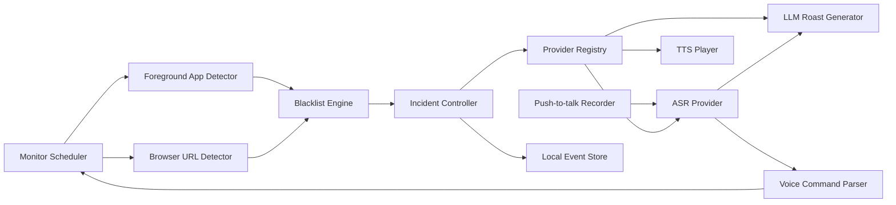

# Hunter PRD

版本：v0.11
日期：2026-06-01
状态：页面结构契约锁定，TTS 回滚为云端 API only

## 0. Discovery Notes

已知输入：

- 目标平台：Mac 桌面端。
- 核心玩法：用户主动开启监督或时长任务后，通过桌面悬浮球/小组件监控摸鱼网站/App，命中后 AI 语音高强度吐槽。
- 语音互动路线：`ASR -> LLM -> TTS`；ASR 支持云端 API 和本地模型，TTS 只支持云端 Provider API。
- ASR、LLM、TTS 均需要做成用户可配置 Provider；普通用户通过内置厂商模板下拉选择厂商，Base URL、鉴权头、region、语言提示等由 Hunter adapter 自动设置，模型 ID 独立为可编辑下拉字段，用户可选厂商推荐模型，也可自定义填写模型名；每类都提供“自定义厂商”，允许用户填写厂商名、Base URL、模型 ID 和 API Key。
- ASR 要提供本地模型下载入口；首选本地 ASR 为 SenseVoice Small INT8。
- TTS 只走云端 API Provider，当前默认 Xiaomi MiMo `mimo-v2.5-tts + 白桦`，并保留 OpenAI `gpt-4o-mini-tts + coral` 和阿里百炼 `cosyvoice-v3.5-flash` 模板；阿里 `cosyvoice-v3.5-flash` 正式链路优先使用用户克隆/设计后的 `voice_id`，不再把 v3 Flash 当作默认阿里模板；不再提供本地 TTS 下载、speech helper 或模型安装入口。
- 声音克隆只走用户授权后的云端 Provider 流程；不做本地 TTS 音色复刻、公众人物音色或第三方未授权样本。
- 软件界面需要支持中英文。
- AI 监督和语音对喷内容需要支持中文和英文；若当前 TTS Provider 支持方言/口音风格，监督语言下拉中追加对应方言选项。
- 悬浮球需要支持语音快速创建时长任务，例如“监督我接下来的 40 分钟”。
- 当前阶段产出可运行原生 macOS App、PRD、设计稿、技术评估、验收清单和可打包 DMG。

待确认问题：

- 第一批黑名单是否以中文互联网内容平台为主，还是同时覆盖海外网站和游戏类 App？
- 吐槽“脏话”边界要做到什么程度：轻粗口、强羞辱、还是只允许用户自定义角色包？
- “强制”档第一版只关闭当前命中的浏览器标签页或请求退出当前前台 App，不做系统级断网、远程控制或不可恢复强杀。
- MiniMax、百度千帆、腾讯/火山语音类服务是否进入普通下拉，取决于后续是否补齐各自专用鉴权、voice id、app id 或 region adapter；在 adapter 可运行前不放入普通用户模板。

## 1. Executive Summary

**Problem Statement**  
普通效率工具太严肃、太弱提醒，用户容易忽略；而“被 AI 当场抓包并开骂”的强冲突体验更容易制造自律压力和传播素材。

**Proposed Solution**  
开发一个 Mac 端轻量 AI 监工应用。主体验是桌面悬浮球/小组件：用户配置黑名单、时长任务和 ASR/LLM/TTS Provider 后，Hunter 在监督开启期间检测前台 App、浏览器 URL 与标签页标题；一旦命中摸鱼目标，先在后台调用 LLM 和 TTS 准备第一句吐槽音频，音频可播放后再展开悬浮小组件并同步播报。用户可以用快捷键或悬浮卡片按钮语音反驳，系统通过 ASR 转写后继续生成语音回应。主窗口只承载设置、Provider、历史记录和语言/音色配置。

**Success Criteria**

- 黑名单命中后 2 秒内出现可见抓包反馈，5 秒内完成首句语音播报。
- 悬浮球常驻桌面时不遮挡主要工作内容，默认尺寸 <= 64px；抓包展开态宽度 <= 360px。
- Chrome/Safari/App 三类检测在本机测试中命中准确率 >= 95%。
- 用户完成从安装、授权、配置黑名单到启动监控的时间 <= 3 分钟。
- 日常 30 次抓包 + 10 分钟语音反驳的云端成本目标 < 1 元/天。
- MVP 内部测试中，80% 以上的抓包事件能产生可用于录屏传播的短句。
- ASR/LLM/TTS Provider 可以分别切换，用户可以用自己的 API Key 跑通完整语音链路。
- 界面中英文切换覆盖 100% MVP 可见文案；AI 监督语言可独立选择中文或英文。

## 2. User Experience & Functionality

### User Personas

- 内容创作者：想拍“AI 监督挑战”“办公室自律实验”类视频，需要强节目效果。
- 自律困难用户：希望通过羞耻感、冲突感和声音提醒减少摸鱼。
- AI 工具玩家：想体验可对喷的桌面 AI 角色，不只是普通提醒工具。

### Core User Flow

1. 用户首次打开 Hunter。
2. 完成权限引导：浏览器自动化、麦克风、通知。
3. 添加网站/App 黑名单。
4. 选择界面语言和 AI 监督语言。
5. 配置 ASR/LLM/TTS；默认 LLM 使用 DeepSeek API，默认 ASR 使用云端 API，TTS 使用云端 Provider；用户可主动切换到本地 SenseVoice 并在客户端内下载模型。
6. 选择 AI 监工角色、吐槽强度和 TTS 音色。
7. 点击“开始监督”，桌面出现轻量悬浮球。
8. 用户也可以按住快捷键说“监督我接下来的 40 分钟”，Hunter 解析出时长并立刻开启一个 40 分钟 Focus Session。
9. 用户进入黑名单 App 或网站。
10. LLM + TTS 准备好第一句音频后，悬浮球展开成小组件并同步开始语音吐槽。
11. 用户按住快捷键语音反驳。
12. Hunter 转写用户语音，生成反击文案，并继续播报。
13. 主窗口历史记录展示抓包次数、摸鱼时长、命中目标和经典语录。

### User Stories And Acceptance Criteria

**Story 1：开启监督和时长任务**
As a user, I want to start, pause, and run timed supervision from Hunter so that I can choose when the app is watching me.

Acceptance Criteria:

- 支持从菜单栏和悬浮球快捷菜单开始/暂停监督。
- 支持从悬浮球快捷菜单或语音指令开启 15/25/40/60/90 分钟等时长任务；设置面板不承载开始、暂停或结束时长任务的操作。
- 监督未开启且没有时长任务时，不触发语音吐槽。
- 暂停或取消时长任务后，黑名单检测和语音吐槽立刻停止。

**Story 2：配置网站和 App 黑名单**  
As a user, I want to define websites and apps that count as slacking so that Hunter can detect meaningful violations.

Acceptance Criteria:

- 支持按域名、URL 关键词、App 名称配置。
- App 黑名单支持读取本机已安装应用列表，用户可以搜索 App 名称或 Bundle ID 并一键加入黑名单。
- 支持快速添加常见平台预设。
- 支持每条规则启用/停用。
- 命中日志能展示具体命中的规则。

**Story 3：被抓包时收到语音吐槽**  
As a user, I want Hunter to roast me immediately when I slack off so that the interruption feels dramatic and hard to ignore.

Acceptance Criteria:

- 监督中桌面显示一个可拖动悬浮球或小组件。
- 未命中黑名单时，悬浮球保持低干扰状态，只显示监督状态；时长任务进行中用圆形头像边缘倒计时环表示剩余时间，不使用右下角红黄绿状态点，也不允许出现方形半透明窗口底板；头像必须收在倒计时环内侧，倒计时环必须完整显示，不能被窗口边缘裁切。
- 用户点击悬浮球时可展开快捷控制菜单，直接开始 15/25/40 分钟监督、查看当前倒计时、暂停/恢复或取消监督，不需要打开主窗口；取消会立即结束当前时长任务并停止监督，不再保留后台倒计时。
- 命中黑名单后先在后台准备吐槽音频；音频准备好后，悬浮球在原位置展开成小组件并开始播报。
- 小组件只展示抓包对象、吐槽文案和用户可操作按钮，不展示 LLM、ASR、TTS、Provider、模型组合或“正在播放中”等内部状态；卡片背景必须是实体 popover 质感，不出现灰色半透明外圈。
- 抓包小组件在播报和用户录音期间显示动态声波；没有播放或录音时声波静止。
- 抓包小组件播报结束且用户几秒内没有继续操作时自动收起，不要求用户手动关闭。
- 命中黑名单后生成一条 10-25 秒内可播完的吐槽。
- 每次吐槽包含命中对象、当前工作状态和角色语气。
- 悬浮球头像固定为圆形裁切，支持用户上传自定义头像并恢复默认头像，不允许头像超出圆环，也不允许出现方形或半透明底板。
- 支持吐槽强度：温柔、鼓励、正经、凶狠。
- 用户可在“人格设定”里单独开启“允许强制关闭”。开启后命中仍先走正常抓包体验：LLM 文案末尾必须包含“我现在就把它关掉”语义，TTS 播放完成后才关闭当前浏览器标签页或对当前前台 App 发起 macOS 正常退出请求。该行为不依赖吐槽强度，但必须依赖用户主动开启监督或时长任务，不做后台远程控制、系统级断网或不可恢复强杀。
- 同一抓包上下文内不重复生成多条语音；用户离开后再次进入黑名单目标才触发下一次抓包。

**Story 4：语音对喷**  
As a user, I want to talk back to Hunter so that the product feels like a live confrontation rather than a static reminder.

Acceptance Criteria:

- 用户可通过快捷键或界面按钮进入录音。
- 用户按住麦克风快捷键时，悬浮球外侧出现绿色呼吸圆环，明确反馈正在收音。
- 默认麦克风快捷键为 `Option + Space`，用户可以在设置页点击快捷键输入框后直接按下新的组合键或单键完成录制；单独的修饰键也要支持，例如右侧 `Option`；抓包卡片按钮展示“按住 {当前快捷键} 对话 / Hold {shortcut} to talk”，并按“按下开始录音、松开发送”执行。
- ASR 返回后，界面展示用户转写文本。
- LLM 根据用户狡辩内容继续回应。
- TTS 播报回应，且日志保存这一轮对话。
- Hunter 播报完成后保持同一抓包上下文，等待用户再次按住快捷键继续下一轮；不得后台自动抢麦克风导致手动按键冲突。
- 用户主动按住麦克风说话时，Hunter 将转写文本、当前监督状态、当前抓包事件和最近对话上下文交给单次 Voice Agent 判断；Agent 要么返回本地工具调用，要么返回聊天回复，不再先做一次本地命令路由再二次请求聊天回复。
- 抓包卡片正在展示或存在当前抓包事件时，也进入同一个 Voice Agent；抓包上下文只作为模型判断语境，不在客户端硬分流为“只能对喷”。如果用户明确要求暂停监督、改强度、换音色、切语言或调整悬浮球，Agent 可以返回对应工具调用；如果用户是在反驳、狡辩、开玩笑或表达情绪，Agent 应继续当前 incident 的连续对话回复。
- 普通语音对话保留当前 App 运行期内的最近上下文，用于连续回应；该对话不写入抓包历史，不冒充用户正在被抓包。
- 普通语音对话的 LLM prompt 必须显式传入当前监督状态：未开启监督/无时长任务时，Hunter 不得以“正在监督、抓到摸鱼、马上关闭”的语境催促或辱骂用户；监督中但未抓包时，也不得谎称命中黑名单。
- Hunter 的 AI 回复文字必须与 TTS 播放同步揭示：TTS 音频成功开始播放后才展示对应回复，播放期间保持可见，播放结束后再收起；不得出现整句文字先弹出、语音延迟数秒才播放的割裂体验。
- 用户按住麦克风讲话时，收音、识别、思考状态在对应语音链路完成前不得被固定时长 toast 自动清除；手动按住录音需要允许完整短对话，不应在几秒内提前切段。
- ASR/LLM/TTS 任一失败时给出可见降级状态；诊断细节只出现在设置/诊断区域，不塞进抓包小组件。

**Story 4.1：语音创建时长监督任务**  
As a user, I want to quickly tell Hunter how long to supervise me so that I can start a focused work session without opening the main window.

Acceptance Criteria:

- 用户按住快捷键后可以说：“监督我接下来的 40 分钟”“帮我开始一个 15 分钟的监督任务”“盯我 25 分钟”“keep me focused for one hour”。
- Hunter 使用自动中英混合 ASR + duration parser 解析出时长和意图；ASR 语言提示不得跟随“AI 监督语言”，避免用户用中文下指令但监督语言设为 English 时识别失败。
- 时长解析需覆盖常见口语表达，例如“三十五分钟”“半小时”“一个半小时”。
- 解析成功后，悬浮球显示确认态，例如“40 分钟监督已开始”；确认 toast 使用实体 popover 背景，不出现半透明灰色矩形底板，并在数秒后自动消失。
- 时长任务期间，黑名单命中会触发抓包吐槽；时长结束后自动回到普通待机或之前的监督开关状态。
- 解析不确定时，悬浮球展示轻量确认，而不是打开主窗口。
- 时长任务可暂停、延长、结束，并写入历史记录。

**Story 4.1A：语音调整监督设置**
As a user, I want to change common Hunter settings by voice so that I can stay in the floating-widget flow instead of opening the settings window.

Acceptance Criteria:

- 用户按住麦克风讲话时，Hunter 调用当前 LLM Provider 的单次 Voice Agent；Agent 根据最新语音、当前监督状态、当前抓包事件和历史对话直接判断本轮是低风险工具调用还是聊天回复。
- 当前有抓包事件或抓包卡片正在等待用户反驳时，仍由同一个 Voice Agent 判断意图；客户端不得因为处于抓包对话就禁止设置工具调用，也不得因为当前强度、音色或语言状态而主动推断用户要改设置。只有最新语音明确表达修改/控制意图时，Agent 才返回工具调用；否则继续当前 incident 的连续对话。
- 第一批可直接执行的语音命令包括：开始监督、暂停/恢复监督、取消当前监督、开始/延长/暂停/恢复/取消时长任务、切换吐槽强度、切换学习/工作监督角色、切换监督语言、切换界面语言、打开/关闭粗口、显示/隐藏悬浮球、切换当前 TTS Provider 下已知的男声/女声或具体音色。
- 语音命令执行后必须给出轻量 toast 和 `voiceInteractionStatus`，并持久化到本机设置；不得只在内存中临时改 UI。
- “取消这次监督”必须立即结束当前时长任务并关闭监督，不继续触发黑名单抓包。
- “换一个男生音色 / 女生音色”只在当前 TTS Provider 有明确可用候选音色时直接执行；没有匹配音色时给出可见提示，不静默切换 Provider。
- 方言/口音类监督语言只在当前 TTS Provider 声明支持时可直接切换；不支持时提示用户当前厂商不可用。
- 黑名单增删、Provider/API Key、声音克隆、授权样本、清空历史等高风险或不可逆设置不得直接静默执行；后续如支持，必须先展示确认态或进入对应设置页。
- Voice Agent 必须只返回受限 JSON schema：`{"type":"tool_call|chat","tool":"...","args":{},"spoken":"...","confidence":0.0}`。`type=tool_call` 时，真正执行仍由 Hunter 本地 allowlist executor 校验并落到 `AppState`/settings store；`type=chat` 时直接播报 `spoken`，不得再发起第二次 LLM 聊天请求。
- 工具调用也必须返回 `spoken`，用于播报“已帮你改成鼓励型”这类自然确认；若本地校验发现工具不可用，以本地校验结果为准。
- 提供 CLI 验证入口，允许开发者在不录音的情况下输入文本并查看 Voice Agent 返回的 `type/tool/args/spoken`；也可通过显式 apply 命令调用同一套本地执行工具写入设置。

**Story 4.2：监督结束后的语音总结**
As a user, I want Hunter to react to the outcome of a focus session so that finishing a session feels like a moment, not just a timer disappearing.

Acceptance Criteria:

- 时长监督正常倒计时结束后，Hunter 根据本轮抓包次数给出一条短语音反馈。
- 0 次抓包：直接彩虹屁式表扬。
- 1-3 次抓包：承认中间摸鱼，但鼓励用户最终完成。
- 4 次及以上：根据粗口开关和语言设置，给出更强的吐槽式总结。
- 总结 toast 与总结语音同步出现：TTS 开始播放后展示总结文案，播放结束后再收起。
- 总结语音走当前 TTS Provider，不使用 macOS 系统朗读；若 TTS 失败，只在状态中报错，不伪装成功。

**Story 5：查看今日抓包记录**  
As a user, I want to review what happened today so that I can use the data as 自律反馈 or video 素材.

Acceptance Criteria:

- 展示今日抓包次数、摸鱼总时长、Top 黑名单对象。
- 展示每次抓包时间、命中对象、AI 吐槽文案。
- 支持一键清除本地日志。

**Story 6：配置模型 Provider**  
As a user, I want to configure my own ASR, LLM, and TTS providers so that I can choose the cost and voice quality that fits me.

Acceptance Criteria:

- ASR、LLM、TTS Provider 可独立配置和启用。
- 云端 Provider 的 MVP UI 展示厂商下拉、可编辑模型 ID 下拉和 API Key；内置厂商自动填 Base URL、鉴权 scheme、headers、region、语言提示和流式能力。模型字段默认给出当前厂商官方文档中的常用和较新模型建议，但允许用户直接输入自定义模型名；用户输入或选择不同模型后，“更新配置”必须变为可点击，点击后持久化当前 Provider 设置并用 toast/状态文本反馈成功或失败。选择“自定义厂商”时展示厂商名、Base URL、模型 ID 和 API Key，自定义 LLM/ASR/TTS 当前分别按 OpenAI-compatible `/chat/completions`、`/audio/transcriptions`、`/audio/speech` 协议调用。
- ASR 额外支持“本地模型 / 云端 API”模式切换；选择本地模型时展示推荐模型、来源、下载按钮和本地路径状态。
- 本地 ASR 使用 SenseVoice Small INT8，下载后可在本机完成短音频识别，不上传用户录音。
- TTS 只走云端 Provider，支持 Provider 模板音色和用户授权后的云端声音克隆流程；声音克隆模块必须跟随当前 TTS Provider 与模型，不在克隆模块内单独选择厂商。只有 TTS 厂商、模型和 API Key 配好后，才展示对应厂商已适配的克隆字段；克隆完成后保存 Provider 返回的授权 voice id，或保存 MiMo 这类 inline sample clone 的本机授权样本引用和 voice reference，不上传到 Hunter 自有服务。
- API Key 进入本机 `Application Support/Hunter/.env.local` 和进程内缓存，不提交仓库、不进入日志；运行热路径不访问 Keychain，避免系统钥匙串授权弹窗。
- 提供“测试 ASR”“测试 LLM”“测试 TTS”三类独立检查。
- 内置本地 SenseVoice ASR、阿里云百炼 ASR/TTS/LLM、OpenAI ASR/TTS/LLM、DeepSeek LLM、Xiaomi MiMo LLM/TTS、Moonshot Kimi LLM、智谱 GLM LLM、火山方舟 Doubao LLM、腾讯混元 LLM 模板；普通用户优先通过下拉模板选择，custom HTTP provider 放入高级模式。模型建议需要跟随各厂商官方模型 ID 维护，例如 DeepSeek V4 Flash/Pro、MiMo V2.5 Pro/V2.5/ASR/TTS/VoiceDesign/VoiceClone、阿里 Qwen3.7/Qwen3.6/Qwen3.5/Paraformer/CosyVoice/Qwen3-TTS、Kimi K2.6、GLM 5.1、Doubao Seed 2.0、Hunyuan T1/TurboS/A13B 等。
- 开始监督、开始时长任务、麦克风对话和 ASR/LLM/TTS 测试前必须校验 ASR/LLM/TTS 配置；任一云端 Provider 缺厂商、Base URL、模型 ID、API Key 名称或实际 API Key，或本地 ASR 模型/runtime 未就绪时，弹窗列出缺失项并引导去 AI 配置，不允许进入长时间等待状态。

**Story 7：中英文界面和监督语言**  
As a user, I want the app and AI supervisor to work in Chinese or English so that different users can use Hunter in their own language.

Acceptance Criteria:

- UI 支持 Simplified Chinese 和 English。
- AI 监督语言使用下拉选择：默认包含跟随界面、中文普通话、English；当当前 TTS Provider 声明支持方言/口音风格时，追加粤语/广东话、四川话、东北话、河南话等 provider 能力项。
- ASR 语言提示由 provider/local adapter 默认处理；后续高级模式再展示自动、中文、English、中英混合。
- LLM prompt 必须显式传入目标输出语言；方言选项的文本基础语言仍按中文处理，TTS adapter 通过 provider 风格指令和音频 tag 触发方言/口音播报。如果模型仍返回明显错误语言，Hunter 需要用目标语言兜底短句，避免用户把监督语言改成 English 后仍听到中文抓包。
- TTS 音色以云端 Provider 的 voice id 或 voice reference 为准，例如 MiMo `白桦` / `苏打` / `mimo_default`、OpenAI `coral`，或阿里 `cosyvoice-v3-flash` / `cosyvoice-v3-plus` 的系统音色 `longanyang`。阿里 `cosyvoice-v3.5-flash` / `cosyvoice-v3.5-plus` 官方无系统音色，必须先创建并选择声音设计或声音克隆后的 `voice_id`；首次使用时若没有可用音色，开始监督、时长任务和麦克风对话都应弹窗提示“请先设置音色”，不得静默发起无效 TTS 请求。
- 声音克隆只走云端 Provider 流程，必须要求用户确认授权，且不复刻公众人物或任何未授权第三方声音；克隆 UI 只读取当前 TTS 配置，当前已适配小米 MiMo inline 授权样本、阿里 CosyVoice `voice-enrollment` + 百炼临时 URL 创建长期 `voice_id`，以及阿里 Qwen3-TTS-VC `qwen-voice-enrollment` 本地样本直传。阿里正式推荐先选 `cosyvoice-v3.5-flash`，Hunter 上传本地样本到百炼 48 小时临时 `oss://` URL 后创建 CosyVoice `voice_id`，查询到 `OK` 后保存；该音色绑定创建时的 TTS 模型，切换模型后需重新创建。其他厂商/模型显示未适配状态，等待后续按厂商 API 规则接入。克隆表单只保留授权、样本、克隆名称、开始克隆和进度；已克隆/设计音色列表统一放在“音色”卡片中，方便用户选择当前音色时直接查看。

## 2A. Frontend Page Contract

本节是设计和实现的页面结构真源。设计稿、SwiftUI 页面和验收清单不得新增未在本节定义的入口、卡片、字段或操作；如发现必要元素缺失，先更新本节再实现。

### Page Tree & Entry Points

| Level | Surface / Screen | Entry Point | Global Navigation | Purpose |
| --- | --- | --- | --- | --- |
| L1 | Floating Orb | App launch, menu bar “Show Widget”, setting toggle | No | 日常主入口，展示监督状态、倒计时、收音/播报反馈 |
| L2 | Quick Control Popover | Click floating orb | No | 快速开始 15/25/40 分钟监督、暂停/恢复、取消、查看倒计时 |
| L2 | Catch Popover | Blacklist hit after TTS is ready | No | 展示抓包对象、短吐槽、声波、按住快捷键对话 |
| L2 | Focus Toast | Voice duration command, session start/end | No | 2-4 秒自动消失的结果确认 |
| L1 | Menu Bar Menu | macOS menu bar icon | No | 开始/暂停、显示设置、显示/隐藏悬浮球、退出 |
| L1 | Settings Window / General | Menu bar “Settings”, first launch | Yes, sidebar | 悬浮球、麦克风快捷键、权限、开机启动 |
| L1 | Settings Window / Watchlist | Sidebar | Yes, sidebar | 网站/App 黑名单、本机 App 选择器、规则管理 |
| L1 | Settings Window / AI Providers | Sidebar | Yes, sidebar | ASR、LLM、TTS、Search 独立 Provider 配置和测试 |
| L1 | Settings Window / Voice & Language | Sidebar | Yes, sidebar | 界面语言、监督语言、角色、强度、粗口、云端音色、授权云端音色克隆 |
| L1 | Settings Window / History | Sidebar | Yes, sidebar | 今日事件摘要、事件列表、清除日志 |

### Navigation Contract

- Settings Window 左侧 sidebar 固定 196px 宽，入口顺序固定为：General、Watchlist、AI、Voice、History。每个导航项整行可点，选中态使用低饱和蓝色背景、蓝色 SF Symbol 和半粗体文字。
- Settings Window 五个 Tab 必须复用同一份 sidebar 模板。左上角窗口控制点、Hunter 图标、Hunter 名称、副标题、导航顺序、导航项高度和间距不得因切换 Tab 改变；只允许 active item 状态变化。
- Settings Window 右侧内容区使用单列 section 列表，内容应充分利用右侧可用宽度，不再固定窄列造成大面积空白；不使用顶部横向菜单，也不在内容区重复展示当前 sidebar 已选中的页面大标题。
- Settings Window 右侧顶部横栏在五个 Tab 中保持同一高度、内边距、背景、分割线和标题排版；切换 Tab 时只更新标题与说明文案。
- Settings Window 不设置全局底部操作条；开始/暂停监督和时长任务只通过菜单栏、悬浮球快捷菜单或语音指令完成，避免设置页承载运行控制。
- Floating Orb 点击只打开 Quick Control Popover，不打开 Settings Window。Settings Window 只能通过 menu bar、sidebar 或系统窗口操作打开。
- Quick Control Popover 和 Catch Popover 均为桌面浮层，6 秒无操作自动收起；用户再次点击 orb 手动收起时，orb 位置不得跳动。
- 权限按钮只能打开系统设置或触发明确的系统授权请求；Hunter 设置窗口在切到 System Settings 后保持可重新打开，回到前台时自动刷新权限状态。

### Shared Component Contract

| Component | Required Structure | States |
| --- | --- | --- |
| SettingsSection | 标题、说明在卡片外上方；下方是一张白色/系统 surface 卡片，卡片内承载该设置的控件、列表或表单；不得把标题说明和控件做成左右分栏 | default, disabled, error, saved/unsaved |
| SettingsCard | 白色/系统 surface，12-14px 圆角，1px 低透明描边；内部内容可按控件需要做横向或纵向布局，但 section 层级必须保持上下分布；多行设置之间统一使用 1px 浅灰分割线和一致的行内边距 | default, empty |
| KeyCaptureBox | 单个可点击输入框，只显示当前快捷键，例如 `Option + Space` 或 `Right Option`；点击后同一个框进入 capturing 状态并显示 `Press new shortcut`，不得同时并排展示“当前值”和“录制中”两个框 | default, capturing, saved, error |
| ProviderCard | Header：Provider role + mode/status；Body：云端模式展示厂商下拉、可编辑模型 ID、自动配置摘要和 API Key；自定义厂商额外展示厂商名与 Base URL；ASR 本地模式展示模型描述、来源、下载状态和本地路径；Footer：测试按钮与状态 | collapsed, expanded, saved, testing, success, error, missing key, local missing |
| PermissionRow | 权限名称、说明文案和一个可点击状态 pill；未允许时点击状态直接打开系统设置或触发授权请求；“可选”只出现在权限名称/说明里，状态 pill 必须展示真实状态如已允许/未开启；不得额外出现“重新检查”“打开设置”等并列按钮 | allowed, notDetermined, denied, optional, unknown |
| InstalledAppRow | App 图标、App 名称、Bundle ID 或路径、Added 状态或移除按钮；未添加 App 只出现在搜索下拉结果中 | added, loading icon |
| Waveform | 5-9 根细圆角条，播报/录音时动画，空闲时静态 | idle, speaking, listening |
| OrbProgressRing | 头像外侧 3px 圆环，蓝色表示剩余时长，绿色呼吸表示收音 | idle, focus, paused, listening, speaking, caught |

### Settings / General Structure

1. **Floating Widget Section**
   - Visible elements：圆形头像预览、`Show Widget` toggle、`Upload Avatar`、`Reset`。
   - Dynamic fields：`showFloatingWidget`、`floatingAvatarPath`。
   - Validation：头像必须圆形裁切，预览不得超出倒计时环。
   - Layout：每一行左侧为说明，右侧为状态或操作；`Show Widget` toggle 固定在卡片右侧。

2. **Microphone Shortcut Section**
   - Visible elements：section 标题“麦克风快捷键”、说明、卡片内一个 KeyCaptureBox、Reset、`Test Voice Command`、一句交互提示“点击输入框后按下新的快捷键；松开后保存”。
   - Dynamic fields：`replyShortcut`、`isCapturingShortcut`、`permission.microphone`。
   - Required behavior：点击框后按任意组合键或单键保存；支持 `Right Option` 等 modifier-only key。
   - Layout：KeyCaptureBox 和 `Test Voice Command` 都靠右排列，左侧只保留说明文案。

3. **Permissions Section**
   - Visible elements：section 标题“权限”、说明、卡片内三条 PermissionRow：Microphone、Browser Automation、Notifications。
   - Dynamic fields：`permissions.microphone`、`permissions.browserAutomation`、`permissions.notifications`。
   - UI rule：每条权限只保留一个可点击状态 pill；通知即使是可选增强，状态 pill 也必须显示真实状态，不能用“可选”代替“已允许/未开启”；未开启时点击状态直接打开系统设置或授权弹窗，回到 Hunter 后自动刷新。

4. **Launch Section**
   - Visible elements：一行文字“允许登录 macOS 后自动运行”、同一行状态文本和右侧 `Launch at Login` toggle。
   - Dynamic fields：`launchAtLogin`。

### Settings / Watchlist Structure

1. **Add Rule Row**
   - Elements：Name text field、Pattern text field、`Add`。本行只添加网站/URL 规则；App 规则通过 Installed Apps Row 搜索并添加。
   - Validation：Pattern 为空时禁用 Add；Name 为空时使用 Pattern。

2. **Preset Row**
   - Elements：YouTube、Bilibili、Douyin、X/Twitter、Reddit、Steam、Discord chips。
   - States：未添加、已添加 disabled。

3. **Installed Apps Row**
   - Elements：section title、description、Refresh、search field、搜索结果下拉、InstalledAppRow list。
   - Dynamic fields：installed app `name`、`bundleIdentifier`、`path` from `/Applications`、`~/Applications`、`/System/Applications`。
   - States：loading、empty、filtered empty、searching、results open、loaded、added。

4. **Rule List Row**
   - Elements：规则名称、kind pill、pattern、enabled toggle、delete。
   - States：enabled、disabled、empty。

### Settings / AI Providers Structure

AI 页面不得出现“基础配置”或跨模型联动配置。ASR、LLM、TTS 三块独立配置。

1. **ASR ProviderCard**
   - Fields：Mode (`Cloud API/Local model`)、厂商下拉、可编辑模型 ID、API Key；云端模板包含阿里百炼 Paraformer 和 OpenAI Transcriptions；选择自定义厂商时展示厂商名与 Base URL。
   - Local mode elements：SenseVoice Small INT8 descriptor、download/status button、local path/status。
   - Actions：Update config、Test ASR。

2. **LLM ProviderCard**
   - Fields：厂商下拉、可编辑模型 ID、API Key；默认 DeepSeek，也可选择 Xiaomi MiMo、OpenAI、阿里百炼、Moonshot Kimi、智谱 GLM、火山方舟 Doubao、腾讯混元模板；选择自定义厂商时展示厂商名与 Base URL。
   - Default template：DeepSeek / `deepseek-v4-flash`。
   - Actions：Update config、Test LLM。
   - Test states：成功展示延迟、模型和语言返回状态；失败展示错误摘要，例如 API Key 无效、Base URL 不可用或模型 ID 错误。

3. **TTS ProviderCard**
   - Fields：厂商下拉、可编辑模型 ID、API Key；默认 Xiaomi MiMo，也可选择 OpenAI 和阿里百炼模板；选择自定义厂商时展示厂商名与 Base URL。
   - No local TTS mode.
   - Actions：Update config、Test TTS。

### Settings / Voice & Language Structure

1. **Language Row**
   - Elements：Interface Language picker、Roast Language picker。Roast Language 必须是下拉菜单，选项由当前 TTS Provider 能力生成。
   - Dynamic fields：`interfaceLanguage`、`aiLanguage`。
   - Behavior：Roast Language 控制 LLM output language and TTS language hint；模型返回明显错误语言时本地兜底。

2. **Persona Row**
   - Elements：Persona picker、custom persona prompt textarea（仅选择“自定义”时展示）、Intensity picker、Allow Force Close toggle、Allow Profanity toggle、Banned Terms text field。
   - Dynamic fields：`persona`、`customPersonaPrompt`、`intensity`、`allowForceClose`、`allowProfanity`、`bannedTerms`。
   - Validation：custom persona prompt 最多 300 字，只进入 LLM system/persona prompt，不进入 TTS 配置；TTS 只负责用当前音色朗读 LLM 生成文本。
   - Persona options：学习监督、工作监督、自定义。
   - Intensity options：温柔、鼓励、正经、凶狠；“允许强制关闭”作为独立开关，在抓包播报完成后额外触发本地关闭动作。

3. **Voice Row**
   - Elements：TTS Voice picker、output volume slider、available voices refresh、Voice Preview button、visible preview status。
   - Dynamic fields：`voice`、`outputVolume`、`availableVoices`、`clonedVoices`。
   - Behavior：内置默认音色随当前 TTS 模板变化，MiMo 默认 `白桦`，OpenAI 默认 `coral`，阿里 `cosyvoice-v3-flash` / `cosyvoice-v3-plus` 默认可选 `longanyang`；阿里 `cosyvoice-v3.5-flash` / `cosyvoice-v3.5-plus` 无系统音色，未选择有效 `voice_id` 时音色区必须提示先设置音色，并在声音设置中把“声音设计”放在“声音克隆”上方。声音设计只提供单个用户输入表单：音色名称、声音描述提示词和生成按钮；音色名称必填，缺失时红框提示并 toast；提示词输入框用灰色 placeholder 展示示例，聚焦输入时 placeholder 必须消失，指导用户描述性别、年龄段、音调、语速、情绪、声音特点、用途和清晰干净要求，不提供预置角色包。试听、开始监督和麦克风对话不得发起无效 TTS 请求。连接 TTS Provider 后可展示 Provider 返回或模板内置的默认音色列表；声音克隆/声音设计成功后音色进入同一 picker，并在“音色”卡片里展示列表。输出音量滑块控制本地播放增益，默认 100%，允许用户在 50%-250% 范围内调整；试听和抓包/对喷/总结播报必须使用同一个音量值。点击试听必须合成并播放当前音色的一句短样例，状态区使用清晰图标和正文级字号展示合成中、播放中、成功或失败，不只显示小号文本。阿里 CosyVoice 合成默认以干净复现音色为优先，不默认启用 SSML 或强情感 `instruction`；只有明确方言/口音等需要时才传入短指令。

4. **Voice Clone Row**
   - Elements：title、current TTS summary、status/locked state、授权确认 checkbox、Upload Sample、Record Sample、sample list、clone name input、`Start Voice Clone`、progress/status、success state、生成后的 voice id。
   - Behavior：声音克隆模块不提供 Provider picker，也不允许在这里切换 TTS；它只同步当前 TTS Provider、模型和 API Key 状态。TTS 未配好时显示收起/锁定说明；TTS 已配好但厂商或模型未适配时显示未适配说明。当前开放小米 MiMo inline 授权样本、阿里 `cosyvoice-v3.5-flash` / `cosyvoice-v3.5-plus` / `cosyvoice-v3-flash` / `cosyvoice-v3-plus` 的 CosyVoice `voice-enrollment`，以及阿里 `qwen3-tts-vc*` voice enrollment；CosyVoice 路径先将本地样本上传为百炼临时 `oss://` URL，再创建并查询 `voice_id` 到 `OK`。必须先确认“我拥有该声音授权”才能上传、录制或开始克隆；不支持公众人物或任何未授权第三方声音；克隆完成后保存云端 Provider 返回的授权 voice id，或对 MiMo 保存 `inlineAuthorizedSample` voice reference，进入同一个音色下拉。用户点击“设为当前音色”后必须出现 toast 或按钮状态反馈；设置成功后清空克隆名称、授权确认、样本、进度和成功态，让用户可以继续创建新的音色。

### Settings / History Structure

1. **Today Summary Row**
   - Elements：抓包次数、今日最多命中对象、最近一次抓包时间。
   - Dynamic fields：`eventsForToday.count`、group by `targetName`、latest date。
   - Empty state：无事件时显示“今天还没抓到你”。

2. **Incident List Row**
   - Elements：time、target、rule/source、roast quote。
   - Dynamic fields：`Incident.date`、`targetName`、`matchedRule`、`roastText`。
   - No copy quote button in MVP;用户没有明确需要，不做。

3. **Clear Logs Row**
   - Elements：`Clear Today` 或 `Clear All Local Logs` button、confirmation text。
   - Behavior：需二次确认或显著危险样式。

### Floating Surface Structure

**Orb**

- Frame：72x72 transparent panel with at least 4px safe inset.
- Elements：progress ring、round avatar、optional animated ring/waveform.
- Forbidden：square translucent backing, clipped ring, green status dot.

**Quick Control Popover**

- Elements：title (`Focus`)、remaining countdown、blue remaining progress bar、15/25/40 minute buttons、Pause/Resume、Cancel、shortcut hint。
- States：no session、running、paused、listening、auto-dismiss.

**Catch Popover**

- Elements：caught target, timestamp, roast text max 3 lines, waveform, hold-to-talk button, optional pause action；roast text 不得原样朗读完整网页标题、URL、长 ID 或 query string。
- States：speaking、listening、thinking、idle waiting、auto-dismiss、TTS failure。
- Repeat behavior：任意黑名单连续命中时，播报流程结束后进入 15-20 秒全局短冷却；当前卡片未收起、TTS 播放中或用户正在语音回复时不得启动下一次抓包。
- Forbidden：provider/model/internal status copy。

**Focus Toast**

- Elements：short title, optional one-line detail, no controls.
- States：session started、session completed praised/encouraged/roasted、parse failed。

### Field Source Matrix

| Field Key | Label | Type | Source of Truth | Derivation / Freshness | Null Handling |
| --- | --- | --- | --- | --- | --- |
| `isMonitoring` | Supervision status | Boolean | `AppState.isMonitoring` | Immediate user toggle / menu bar | Off |
| `focusSession.remaining` | Remaining time | TimeInterval | `FocusSession` | Recomputed every tick | Hide countdown |
| `focusSession.catchCount` | Session catch count | Int | Incidents linked to session | Updated on incident | 0 |
| `showFloatingWidget` | Floating widget | Boolean | `AppState.showFloatingWidget` | Immediate | On by default |
| `replyShortcut` | Talk shortcut | Struct | `AppState.replyShortcut` | Persisted on capture | `Option + Space` |
| `permissions.*` | Permission state | Enum | `PermissionCenter.snapshot()` | Refresh on active + 1.5s timer while settings visible | Unknown |
| `rules[]` | Watchlist rules | Array | Local store | Immediate add/delete/toggle | Empty list with presets |
| `installedApps[]` | Installed apps | Array | `InstalledAppScanner` | On page load / refresh | Empty state |
| `providers.asr/llm/tts/search` | Provider config | Object | Local settings + `.env.local` secret | Persist on edit | Missing key pill |
| `interfaceLanguage` | Interface language | Enum | Local settings | Immediate | Chinese |
| `aiLanguage` | Roast language | Enum | Local settings + current TTS provider capabilities | Used per LLM/TTS request | Follow interface |
| `voice` | TTS voice ID / reference | String | Local settings | Used per TTS request | Provider default |
| `eventsForToday` | Today incidents | Array | Local incident store | Filter by local calendar day | Empty summary |

### Interaction & Error Contract

- Settings 表单字段编辑后立即保存本地设置；API Key 字段失焦或点击保存时写入本地 secret store，显示 `•••••••• + saved`，不回显明文。
- Provider 测试按钮进入 running state，成功显示 bytes/model/provider 摘要，失败显示用户可读错误；详细日志只写诊断文件。
- Voice command 解析失败时只显示轻 toast，不打开设置窗口。
- TTS 失败不得回退到系统朗读；必须显示可见错误状态并写入诊断。
- Browser automation 未授权时监控循环跳过 URL 读取，不弹系统框；只有用户点击授权按钮才请求。
- 当前 MVP 不把辅助功能列为用户必配权限；前台 App 识别、浏览器标题/URL、常规全局快捷键都不依赖辅助功能。若后续接入真正依赖 Accessibility 的高级能力，需在对应功能旁单独提示。

### Design Coverage Gate

- 每个 L1/L2 surface 必须至少有一个视觉稿或组件状态样例。
- 每个 Settings 页面必须有页面级结构图、字段列表和至少一个主要错误/空状态说明。
- 每个浮层状态必须在设计稿或组件板中出现：idle、quick control、caught speaking、listening、focus toast。
- SwiftUI 实现不得引入 PRD 未定义的字段、按钮或统计指标。

### Non-Goals

- 不做老板/管理员远程监控员工。
- 不做隐身后台采集或不可关闭监控。
- MVP 不做跨设备同步、团队排行、远程管理后台。
- MVP 不做强制断网、不可恢复强杀、系统级拦截、老板/管理员远程控制。仅当用户主动开启“允许强制关闭”并开启监督时，Hunter 可以在抓包播报完成后关闭当前命中的浏览器标签页，或对当前前台黑名单 App 发起正常退出请求。
- MVP 不做公开视频自动生成，只提供适合录屏的 UI 和日志。
- MVP 不内置任何云端 API Key，也不提供代付模型额度。

## 3. AI System Requirements

### Tool Requirements

- ASR：实时或准实时语音识别，支持普通话、英语、中英混合、口语化表达、短音频低延迟。
- LLM：中英文吐槽、角色扮演、上下文记忆、粗口边界控制、低成本。
- TTS：中英文自然语音，支持指定云端音色；优先支持授权音色复刻或音色设计。
- Provider 层：统一封装 `transcribe(audio, options)`, `generateRoast(context, options)`, `speak(text, voice, options)`。
- Provider 配置层：支持内置模板、自定义 provider、连接测试、启停、成本备注和能力标签。

### Prompt Requirements

LLM 输入最少包含：

- 命中对象：App 名称、URL 域名或规则名。
- 页面上下文：完整浏览器标签标题、URL host；完整网页标题作为 LLM 判断当前内容的关键上下文保留，但不得被原样照读进播报文本。
- 当前阶段：首次抓包、连续摸鱼、用户反驳。
- 用户配置：吐槽强度、角色、禁用词、是否允许强制关闭、是否允许粗口、输出语言。角色为学习监督、工作监督或自定义；学习监督会把分心与复习、练习、作业、考试和记忆进度关联，工作监督会把分心与任务交付、截止时间、工作节奏和产出质量关联；强度为温柔、鼓励、正经、凶狠。鼓励模式是陪伴式正向引导，不强调抓包、不点名分心 App/网站，重点是鼓励用户坚持完成任务、避免继续分心；凶狠模式在用户允许粗口后可以使用更强、更脏、更命令式的脏话，火力集中在摸鱼行为、拖延借口和当下选择上，并禁止仇恨辱骂、真实威胁和受保护属性攻击。
- Provider 能力：模型名称、语言支持、TTS 音色语言、方言/口音风格支持、是否支持流式。
- 安全边界：不攻击受保护属性，不鼓励自伤，不输出真实威胁。

### Evaluation Strategy

- ASR：20 条用户反驳样本，普通话转写字错率目标 <= 10%。
- ASR：20 条英文反驳样本，英文转写词错率目标 <= 15%。
- LLM：100 条命中场景，人工评分“好笑/有冲突/不越界”，通过率 >= 80%。
- LLM：中英文输出语言遵循率 >= 98%。
- TTS：10 个默认音色 A/B 测试，选择清晰度、情绪表现、延迟综合最优的 3 个。
- 端到端：模拟 30 次抓包，平均首句播报延迟 <= 5 秒。

## 4. Technical Specifications

### Architecture Overview

### macOS Components

- Menu Bar Controller：展示状态、开始/暂停、快速入口。
- Settings Window：时长任务、黑名单、声音、角色、隐私设置。
- Monitor Service：定时检测前台 App 和浏览器 URL。
- Incident Controller：处理命中、冷却、文案生成、播报和日志。
- Voice Session：负责录音、ASR、LLM 回应、TTS 播放。
- Voice Command Parser：解析“监督我接下来的 40 分钟”等时长任务意图。
- Focus Session Manager：管理临时时长监督任务、倒计时、暂停、延长和结束。
- Provider Registry：保存 ASR/LLM/TTS 的用户配置、内置模板和连接状态。
- Localization Manager：管理 UI 语言、AI 输出语言和 provider 语言提示。
- Local Store：保存配置、规则、日志和音色元数据。

### Integration Points

- macOS 权限：浏览器自动化、麦克风、通知。
- Chrome/Safari：通过脚本读取当前标签 URL；监控循环只做静默自动化权限检查，未授权时不主动弹系统授权框。
- 云端模型 API：ASR、LLM、TTS。
- 本地模型 runtime：SenseVoice ASR 及配套模型缓存。
- Local Secret Store：保存 API Key 引用和本机 `.env.local` 密钥。
- i18n 资源：中英文 UI 文案、默认角色 prompt、默认吐槽模板。

### Security & Privacy

- 默认只上传被抓包时的最小上下文，不上传完整浏览历史。
- 用户反驳音频仅用于 ASR，默认不保留原始音频。
- 本地日志默认可清除。
- 音色复刻需要显式授权确认，并记录授权状态。
- 调试日志不得打印 API Key、完整 URL 查询参数或原始音频内容。
- Provider 导入/导出默认不包含 API Key。

## 5. Risks & Roadmap

### Phased Rollout

**MVP：抓包播报闭环**

- 桌面悬浮监督小组件。
- 语音快速创建时长监督任务。
- 菜单栏入口和轻量主窗口。
- 时长任务和黑名单配置。
- 前台 App + Chrome/Safari URL 检测。
- 命中后 LLM 文案 + TTS 播报。
- Provider 配置框架，内置阿里云百炼模板和本地 SenseVoice ASR。
- 中英文 UI 与 AI 输出语言设置。
- 本地日志。

**v1.1：语音对喷**

- Push-to-talk 反驳。
- ASR 转写。
- 多轮对喷上下文。
- 角色包和强度细化。
- 更多 Provider 模板和音色复刻流程。

**v1.2：传播增强**

- 今日名场面榜单。
- 经典语录复制。
- 录屏友好的抓包浮窗。
- 可导出日报文案。

**v2.0：挑战模式**

- 8 小时不摸鱼挑战。
- 失败惩罚规则。
- 朋友监督/本地房间。
- 可选视频片段自动剪辑。

### Technical Risks

- macOS 浏览器 URL 读取需要自动化权限，用户授权路径可能影响转化。
- 不同浏览器和多窗口场景会增加检测复杂度。
- 云端 TTS 延迟可能削弱“当场抓包”效果，需要缓存常用吐槽或接入真正流式 TTS。
- 用户自定义 Provider 会带来鉴权、协议和错误格式差异，需要统一错误模型。
- 中英文对喷质量取决于供应商语言能力，需要在 Provider 能力标签里给出提示。
- 粗口吐槽需要可控，避免越界输出导致产品风险。
- 音色复刻涉及授权和合规，不能默认开放第三方声音复刻。
